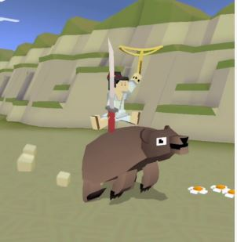
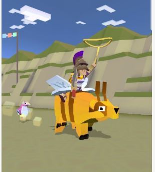
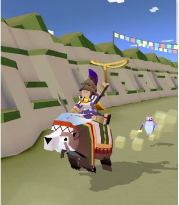
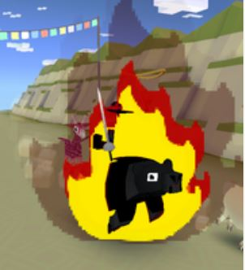

## 산
### 곰

+ 업그레이드

      1. 라마의 차분한 상태 1초 연장
      2. 라마에서 점프 거리 증가
      3. 라마에서 점프하면 일시적으로 올가미 밧줄 크기 20% 증가
      4. 라마의 티켓 수입 50% 증가
      5. 라마의 차분한 상태 1초 연장
      6. 라마에 착지하면 올가미 밧줄 크기가 줄지 않음
      7. 라마에서 장거리 점프 시 보너스 동전 획득
      8. 스탬피드 중에 희귀 라마의 출현 빈도 2배 증가
      9. 스탬피드에 새로운 희귀 라마 추가
***
+ 특징 : 화가 날 때 플레이어를 멀리 던져버린다. 나무를 들이받아 부숴버린다.
동족을 제외한 모든 생물을 잡아먹을 수 있다.
***
+ 종류

  1. 불곰  (기본 동물)
      + 사진 : 
      + 설명 : 무시무시한 잡식 동물로, 겨울에는 동면합니다.
나무를 타거나 땅을 파거나 헤엄을 칠 줄 알지만 눈이 나빠서 운전 면허 시험에서 늘 떨어집니다.
      + 출현거리 : 0m 부터
      + 경험치 획득량 : 0xp
      + 새끼 동물 능력 : 동물을 6%더 효과적으로 잡아먹는다.
***
  2. 느림보곰
      + 사진 : 
      + 설명 : 완전범죄에 딱인 변장의 대가입니다.
      + 출현거리 : 200m 부터
      + 경험치 획득량 : 1xp
      + 새끼 동물 능력 : 화가나면 7%느려진다, 7%를 더 잡아먹는다
***
  3. 곰추장
      + 사진 : 
      + 설명 : 혼자 지내는 것을 좋아하는 동물이라서 사실 추장직은 하는 둥 마는 둥 합니다.
      + 출현거리 : 750m 부터
      + 경험치 획득량 : 4xp
      + 새끼 동물 능력 : 길들인 동물이 15%더 빠르다, 10% 더 잡아먹는다.
***
  4. 곰케이크
      + 사진 : 
      + 설명 : 파티에서 흥을 담당하는 전문 엔터테이너입니다. 무엇이든 먹으며 어린이들을 좋아합니다.
      + 출현거리 : 1300m 부터
      + 경험치 획득량 : 12xp
      + 새끼 동물 능력 : 미션수행시 15%코인 추가획득, 10%동물을 더 먹는다, 상자획득시 4% 추카코인.
***
  5. 비버곰
      + 사진 : 
      + 설명 : 부지런한 건설 노동자입니다. 쉬지 않고 일하면서 일년 중 6개월동안 잡니다.
      + 출현거리 : 1800m 부터
      + 경험치 획득량 : 25xp
      + 새끼 동물 능력 : 탄 동물이 6%더 느리다, 8%더 빠르게 뛴다, 6% 더 잡아먹는다.
***
  6. SU_24 곰비행기
      + 사진 : 
      + 설명 : 특급 기밀 소비에트 곰으로, 음속으로 졸면서 다수의 목표물을 간식으로 먹어치울 수 있습니다.
      + 출현거리 : 2000m 부터
      + 경험치 획득량 : 8xp
      + 새끼 동물 능력 : 올가미가 7%더 크다, 7%더 잡아먹는다, 나는동물을 7%느리게한다.
      + 비밀 동물 : 산독수리를 타고 2000m 넘으면 등장
***
  7. TIME LOCKER 곰
      + 사진 : 
      + 설명 : 다른 게임에서 온 방문자입니다. 상점에서 확인하세요!
      + 출현거리 : 1300m 부터
      + 경험치 획득량 : 12xp
      + 새끼 동물 능력 : 올가미가 5%늦게 가라앉는다, 6%더 높게뛴다, 8%더 잡아먹는다.
      + 희귀동물 : 레벨 9 업그레이드 후 등장
***
  8. 블람베어
      + 사진 : 
      + 설명 : 전세계를 여행하며 ‘스크린쉐이크의 기술’을 가르치며 훌륭한 인디 게임들을 만듭니다.
      + 출현거리 : 1300m 부터
      + 경험치 획득량 : 25xp
      + 새끼 동물 능력 : 길들여진 동물이 20%더 빠르다, 10% 더잡아먹는다, 희귀동물 확률 1%증가
      + 멸종위기종 : 하루에 한번씩 달라지는 멸종위기종을 잡는 시기에 잡을 수 있다.
***
  9. 자이언트판다
      + 사진 : 
      + 설명 : 말로 표현할 수 없을 만큼 귀엽습니다.
      + 출현거리 : 1300m 부터
      + 경험치 획득량 : 4xp
      + 새끼 동물 능력 : 화나면 8%느려진다, 8%더 높게뛴다, 6%더 잡아먹는다, 희귀동물확률 1%증가
      + 이벤트 동물 : 2018년 구정 이벤트
