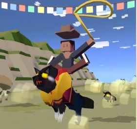

## 산
### 늑대

+ 업그레이드

      1. 스탬피드 중에 곰의 출현 빈도 2배 증가
      2. 늑대를 타는 동안 상자 보상 3배 증가
      3. 늑대의 차분한 상태 2초 연장
      4. 늑대의 티켓 수익 50% 증가
      5. 질주 중에 충돌하면 늑대가 던져버림
      6. 공중에 있을 때 늑대가 올가미 밧줄로 다가옴
      7. 늑대를 타고 최고 속도로 질주하면 보너스 동전 획득
      8. 스탬피드 중에 희귀 늑대의 출현 빈도 2배 증가
      9. 스탬피드에 새로운 희귀 늑대 추가
***
+ 특징 : 화가 날 때 점점 빠른 속도로 달린다.
***
+ 종류

  1. 회색 늑대  (기본 동물)
      + 사진 : 
      + 설명 : 재빠른 추적자입니다.
      무리를 지어 다니기를 좋아하며 이동하는 동물의 떼를 뒤쫓곤 합니다.
      GPS와 SNS 덕분에 요즘 살기 편해졌다고 합니다
      + 출현거리 : 0m 부터
      + 경험치 획득량 : 0xp
      + 새끼 동물 능력 : 탄 동물이 5%더 빠르다, 길들인 동물 10%더빠름
***
  2. 불늑대
      + 사진 : 
      + 설명 : 무슨 일이 있어도 절대로 사촌인 얼룩이리와 어울리게 해서는 안 됩니다.
      + 출현거리 : 200m 부터
      + 경험치 획득량 : 1xp
      + 새끼 동물 능력 : 탄 동물 10%더 빠름, 5% 더 높게뜀, 갈들인 동물 8%더 빠름
***
  3. 생존자늑대
      + 사진 : 
      + 설명 : 전형적인 마초 동물입니다. 리얼리티 쇼 스타와의 사투에서 이겨서 그 잔해를 트로피로 걸치고 다닙니다.
      + 출현거리 : 750m 부터
      + 경험치 획득량 : 4xp
      + 새끼 동물 능력 : 탄 동물8% 더빠름, 길들인 짝지은 동물 25% 더빠름, 길들인동물 1%더빠름.
***
  4. 크고나쁜늑대
      + 사진 : 
      + 설명 : 코스프레를 즐깁니다. 할머니나 우아한 사슴 흉내내기를 좋아합니다.
      다른 늑대들은 이상하게 생각하지만 개인의 취향은 존중합시다.
      + 출현거리 : 1300m 부터
      + 경험치 획득량 : 12xp
      + 새끼 동물 능력 : 탄 동물6% 더 빠르다, 길들인 동물 7%더 빠르다, 12% 더잡아먹는다.
***
  5. 재버늑대
      + 사진 : 
      + 설명 : "황금빛 밧줄이 샤샤샥! 새로운 친구를 만들어, 끝내는 다각거리며 돌아왔네."
      + 출현거리 : 1800m 부터
      + 경험치 획득량 : 25xp
      + 새끼 동물 능력 : 탄동물 5%더 빠르다, 희긔동물 확률 12%증가, 길들인동물 7%더 빠름.
***
  6. 애꾸눈늑대수염
      + 사진 : 
      + 설명 : 늑대들 중에서 가장 악명 높은 해적입니다! 유일한 해적 늑대이기도 하지요.
      + 출현거리 : 1800m 부터
      + 경험치 획득량 : 8xp
      + 새끼 동물 능력 : 올가미가 7%더 크다, 상자획득시 35%추가 코인, 길들인 동물 7% 빠름.
      + 보스 동물 : 일정양의 미션을 클리어 후 보스 미션에서 등장.
***
  7. TIME LOCKER 개
      + 사진 : 
      + 설명 : 다른 게임에서 온 방문자입니다. 상점에서 확인하세요!
      + 출현거리 : 1300m 부터
      + 경험치 획득량 : 12xp
      + 새끼 동물 능력 : 탄 동물 5%더빠르다, 미션수행시 15% 추가코인 획득, 길들인 동물 12%더 빠르다.
      + 희귀동물 : 레벨 9 업그레이드 후 등장
***
  8. 케르베로스
      + 사진 : 
      + 설명 : 세 개의 머리가 각각 자기가 제일 착한 개라고 아직도 다투고 있습니다.
      + 출현거리 : 1300m 부터
      + 경험치 획득량 : 25xp
      + 새끼 동물 능력 : 올가미가 6%빠르게 가라앉음, 동물로부터 10% 빠르게 뛴다, 길들인 동물 15%더 빠름.
      + 멸종위기종 : 하루에 한번씩 달라지는 멸종위기종을 잡는 시기에 잡을 수 있다.
***
  9. 스릴러늑대
      + 사진 : 
      + 설명 : 유한한 생명을 가진 존재 중에서 스릴러 늑대의 사악함을 견뎌낼 수 있는 이는 없지요!
      + 출현거리 : 1200m 부터
      + 경험치 획득량 : 4xp
      + 새끼 동물 능력 : 탄 동물 5%더 느리다, 10% 더 높게뛴다, 길들인 동물 10%더 빠르다.
      + 이벤트 동물 : 2017년 할로윈 이벤트
