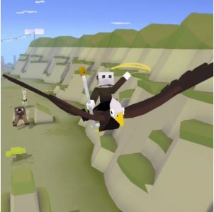
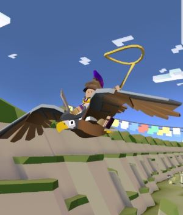
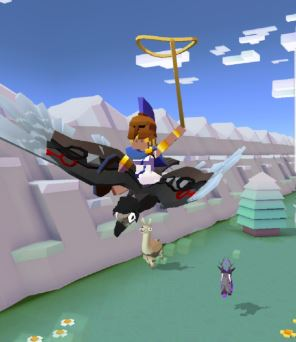
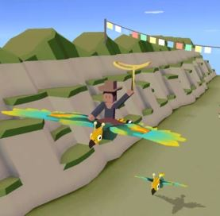
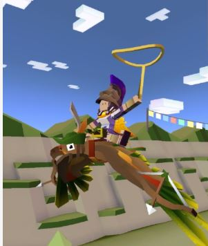
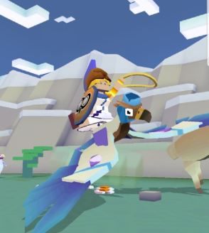
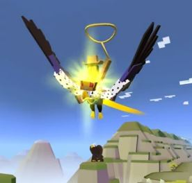

## 산
### 독수리

+ 업그레이드

      1. 스탬피드 중에 독수리의 출현 빈도 2배 증가
      2. 독수리의 차분한 상태 1초 연장
      3. 독수리의 안정적인 비행시간 증가
      4. 독수리의 티켓 수익 50% 증가
      5. 독수리 타는 동안 상자 보상 5배 증가
      6. 독수리의 차분한 상태 1초 연장
      7. 독수리에서 급강하 시 보너스 동전 획득
      8. 스탬피드 중에 희귀 독수리의 출현 빈도 2배 증가
      9. 스탬피드에 새로운 희귀 독수리 추가
***
+ 특징 : 화가 날 때 위아래로 오르락내리락 한다. 야생상태에서는 맵 중앙또는 절벽쪽의 바위에 앉아있다.
***
+ 종류

  1. 대머리독수리  (기본 동물)
      + 사진 : 
      + 설명 : 최대 2.3m의 날개폭을 자랑하는 맹금. 높은 곳을 좋아하며 주식은 애국심입니다.
      정말로 대머리는 아니고, 곱게 늙어가는 중입니다.
      + 출현거리 : 0m 부터
      + 경험치 획득량 : 0xp
      + 새끼 동물 능력 : 나는 동물의 급습이 6%느려진다.
***
  2. 호크 경
      + 사진 : 
      + 설명 : 영토의 성실한 수호자입니다. 중장갑을 착용하고도 날 수 있지만, 탄 사람에게는 힘들 수도 있습니다.
      + 출현거리 : 200m 부터
      + 경험치 획득량 : 1xp
      + 새끼 동물 능력 : 탄 동물이 6%더 느리다, 급습이 6%느려진다.
***
  3. 이글워드 가위날개
      + 사진 : 
      + 설명 : 사람들에게 이해받지 못하는 천재적인 예술가입니다. 울타리 손질은 잘 하지만 포옹은 잘 못합니다.
      + 출현거리 : 800m 부터
      + 경험치 획득량 : 4xp
      + 새끼 동물 능력 : 올가미가 8%느리게 떠러진다, 길들인 동물이 10%더 빠르다, 급습이 8%느려진다.
***
  4. 배트큘라 백작
      + 사진 : 
      + 설명 : 음침한 패셔니스타입니다. 영문도 모르는 대상에게 다가가서 파격적인 변신을 시켜줍니다.
      다른 늑대들은 이상하게 생각하지만 개인의 취향은 존중합시다.
      + 출현거리 : 1300m 부터
      + 경험치 획득량 : 12xp
      + 새끼 동물 능력 : 8%더 높게뛴다, 미션 수행시 12% 추가코인 획득, 급습이 6%느려진다.
***
  5. 큰독수리 나방
      + 사진 : 
      + 설명 : 세계에서 가장 큰 비행 곤충입니다.
      밝은 빛과 반짝이는 물건에 끌립니다. 차 유리창에 부딪히기라고 하면 닦아내기 힘듭니다.
      + 출현거리 : 1600m 부터
      + 경험치 획득량 : 25xp
      + 새끼 동물 능력 : 6%높게뛴다, 희귀동물 발견확률이 6%높아진다, 급습이 8%느려진다.
***
  6. 로빈수리
      + 사진 : 
      + 설명 : 부자에게서 재물을 훔쳐서 가난한 이들에게 나눠주고 싶어 합니다. 하지만 방법을 모른다네요.
      + 출현거리 : 0m 부터
      + 경험치 획득량 : 3xp
      + 새끼 동물 능력 : 올가미가 7%더 크다, 상자획득시 35%추가 코인, 길들인 동물 7% 빠름.
      + 비밀 동물 : 양 측면 절벽의 특정 구간으로 점프시 획득 가능.
***
  7. 비행기 승무원
      + 사진 : 
      + 설명 : 자리에 앉아 계시고 밧줄을 단단히 붙잡으십시오. 즐거운 비행 되시기 바랍니다!
      + 출현거리 : 1000m 부터
      + 경험치 획득량 : 12xp
      + 새끼 동물 능력 : 급습이 15% 느려진다.
      + 희귀동물 : 레벨 9 업그레이드 후 등장
***
  8.제왕 독수리
      + 사진 : 
      + 설명 : 제왕 독수리의 말을 거역하는 것은 불법입니다.
      + 출현거리 : 1000m 부터
      + 경험치 획득량 : 25xp
      + 새끼 동물 능력 : 급습이 6%느려진다, 미션수행시 24% 추가코인 획득
      + 멸종위기종 : 하루에 한번씩 달라지는 멸종위기종을 잡는 시기에 잡을 수 있다.
