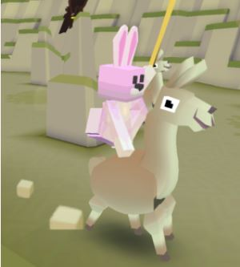
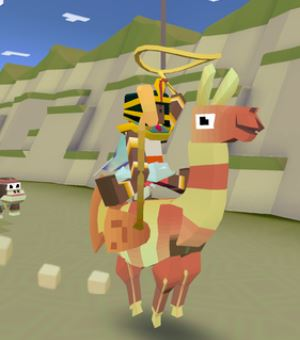
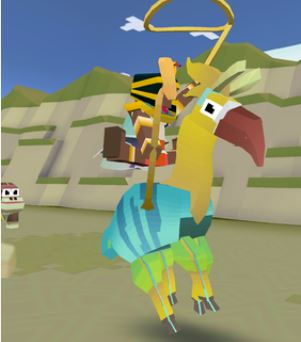
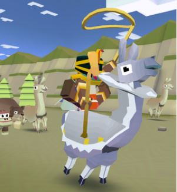
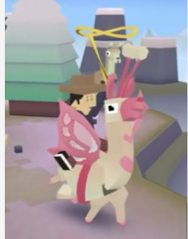
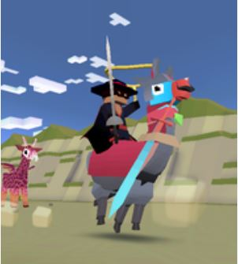
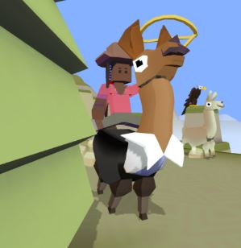
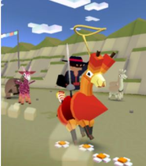

## 산
### 라마

+ 업그레이드

      1. 라마의 차분한 상태 1초 연장
      2. 라마에서 점프 거리 증가
      3. 라마에서 점프하면 일시적으로 올가미 밧줄 크기 20% 증가
      4. 라마의 티켓 수입 50% 증가
      5. 라마의 차분한 상태 1초 연장
      6. 라마에 착지하면 올가미 밧줄 크기가 줄지 않음
      7. 라마에서 장거리 점프 시 보너스 동전 획득
      8. 스탬피드 중에 희귀 라마의 출현 빈도 2배 증가
      9. 스탬피드에 새로운 희귀 라마 추가

+ 종류

  1. 라마 (기본 동물)
      + 사진 : 
      + 설명 : 장난기와 호기심이 많고 온순합니다. 침 뱉기를 좋아하며, 상당히 멀리까지 뱉을 수 있습니다.
      조사원들이 수를 세러 갔다가
      모두 잠에 드는 바람에 개체수는 미상입니다.
      + 출현거리 : 0m 부터
      + 경험치 획득량 : 0xp
      + 새끼 동물 능력 : 6%빠르게 뛴다.

  2. 짠물 라마
      + 사진 : 
      + 설명 : 산호초 주변에서 주로 발견됩니다. 비록 말미잘에 면역이 있지만 아직 헤엄은 못 칩니다.
      + 출현거리 : 200m 부터
      + 경험치 획득량 : 1xp
      + 새끼 동물 능력 : 탄 동물이 4%느리게 뛴다, 다른 동물보다7% 바르게 뛴다.
  3. 피냐타라마
      + 사진 : 
      + 설명 : 골판지로 만들어졌으며 안에는 사탕이 가득합니다.
      운명의 순간이 찾아오기 전 짝을 홀리기 위해 화려한 색깔로 이루어져 있습니다.
      + 출현거리 : 800m 부터
      + 경험치 획득량 : 4xp
      + 새끼 동물 능력 : 7%빠르게 뛴다, 상자획득시 25%추가 코인, 미션 수행시 8%추가 코인
  4. 엘리자베스풍라마
      + 사진 : 
      + 설명 : 도도하면서도 우아합니다. 절도 있게 인사할 줄 압니다
      + 출현거리 : 1300m 부터
      + 경험치 획득량 : 12xp
      + 새끼 동물 능력 : 밧줄이 6%크게 시작한다, 9%빠르게 뛴다, 길들인 동물이 15%빠르다.
  5. 나비라마
      + 사진 : 
      + 설명 : 아침 햇살 아래 이슬을 마시기 위해 꽃들 사이를 돌아다닙니다. 몸무게는 200kg입니다.
      + 출현거리 : 1800m 부터
      + 경험치 획득량 : 25xp
      + 새끼 동물 능력 : 6%빠르게 뛴다, 짝동물 확률 20%증가, 길들인 동물1%빠르다.
  6. 하이퍼광라마
      + 사진 : 
      + 설명 : 방랑자. 전장의 군주. 진실과 정의의 캐시미어 스웨터를 위해 어디서든 부패에 맞서 싸웁니다.
      + 출현거리 : 1800m 부터
      + 경험치 획득량 : 25xp
      + 새끼 동물 능력 : 탄 동물이 10%빠르다, 8%빠르게 뛴다, 희귀동물 발견확률 7%증가.
      + 보스 동물 : 일정양의 미션을 클리어 후 보스 미션에서 등장.
  7. 버락 오블라마
      + 사진 : 
      + 설명 : 라마리카 합중국의 44번째 대통령
      + 출현거리 : 1300m 부터
      + 경험치 획득량 : 12xp
      + 새끼 동물 능력 : 6%빠르게 뛴다, 미션수행시 15%의 추가코인, 길들인 동물은 5%빠르다.
      + 희귀동물 : 레벨 9 업그레이드 후 등장
  8. 알파카 폭죽
      + 사진 : 
      + 설명 : 팡팡 터트려 주세요!
      + 출현거리 : 1100m 부터
      + 경험치 획득량 : 25xp
      + 새끼 동물 능력 : 8% 높게 뛰고, 점프한다.
