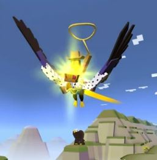
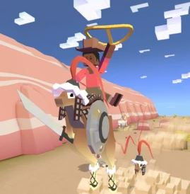
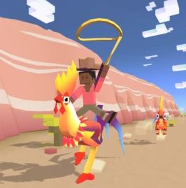

## 멸종위기종
***
### 사바나
#### 1. Buff the Magic Dragon

+ 종 : 버팔로
+ 발견지역 : 사바나5
+ 발견거리 : 600m
+ 경험치 : 30xp
+ 사진 : 

#### 2. Zegasus

+ 종 : 버팔로
+ 발견지역 : 사바나5
+ 발견거리 : 1600m
+ 경험치 : 30xp
+ 사진 : 

#### 3. World's Tallest Sheep

+ 종 : 버팔로
+ 발견지역 : 사바나5
+ 발견거리 : 1800m
+ 경험치 : 30xp
+ 사진 : 

#### 4. Volture

+ 종 : 버팔로
+ 발견지역 : 사바나5
+ 발견거리 : 1100m
+ 경험치 : 30xp
+ 사진 : 

#### 5. Nian Monster

+ 종 : 버팔로
+ 발견지역 : 사바나5
+ 발견거리 : 2200m
+ 경험치 : 30xp
+ 사진 : 

***
### 정글
#### 1. BoarBQ

+ 종 : 돼지
+ 발견지역 : 정글1
+ 발견거리 : 1300m
+ 경험치 : 25xp
+ 사진 : 

#### 2. Gorill-uck

+ 종 : 고릴라
+ 발견지역 : 정글1
+ 발견거리 : 1300m
+ 경험치 : 25xp
+ 사진 : 

#### 3. Termigator

+ 종 : 악어
+ 발견지역 : 정글1
+ 발견거리 : 1300m
+ 경험치 : 25xp
+ 사진 : 

#### 4. Sabretooth Hippo

+ 종 : 하마
+ 발견지역 : 사바나5
+ 발견거리 : 1800m
+ 경험치 : 25xp
+ 사진 : 

#### 5. Tigermoth

+ 종 : 호랑이
+ 발견지역 : 사바나5
+ 발견거리 : 1800m
+ 경험치 : 25xp
+ 사진 : 

#### 6. Bazookan

+ 종 : 투칸
+ 발견지역 : 사바나5
+ 발견거리 : 1300m
+ 경험치 : 25xp
+ 사진 : 
***
### 산
#### 1. Alpaca Cracker

+ 종 : 라마
+ 발견지역 : 산1
+ 발견거리 : 1300m
+ 경험치 : 25xp
+ 사진 : 

#### 2. Vlambeer

+ 종 : 곰
+ 발견지역 : 산1
+ 발견거리 : 1300m
+ 경험치 : 25xp
+ 사진 : 

#### 3. Cerberus

+ 종 : 늑대
+ 발견지역 : 산2
+ 발견거리 : 1300m
+ 경험치 : 25xp
+ 사진 : 

#### 4. Zodiyak

+ 종 : 야크
+ 발견지역 : 산3
+ 발견거리 : 1300m
+ 경험치 : 25xp
+ 사진 : 

#### 5. Regal Eagle

+ 종 : 독수리
+ 발견지역 : 산4
+ 발견거리 : 1300m
+ 경험치 : 25xp
+ 사진 : 

#### 6. Zeus Moose

+ 종 : 무스
+ 발견지역 : 산5
+ 발견거리 : 1800m
+ 경험치 : 25xp
+ 사진 : 
***
### 오지

#### 1. Lambembert Cheese

+ 종 : 양
+ 발견지역 : 오지1
+ 발견거리 : 800m
+ 경험치 : 25xp
+ 사진 : 

#### 2. Mongol Roo

+ 종 : 캥거루
+ 발견지역 : 오지1
+ 발견거리 : 1400m
+ 경험치 : 25xp
+ 사진 : 

#### 3. Professor Dropbear

+ 종 : 드롭베어
+ 발견지역 : 오지1
+ 발견거리 : 1300m
+ 경험치 : 25xp
+ 사진 : 

#### 4. Cock-a-doodle-emu

+ 종 : 에무
+ 발견지역 : 오지3
+ 발견거리 : 1600m
+ 경험치 : 25xp
+ 사진 : 

#### 5. Mystic Camel

+ 종 : 낙타
+ 발견지역 : 오지4
+ 발견거리 : 1800m
+ 경험치 : 25xp
+ 사진 : 

#### 6. Cute Bat

+ 종 : 박쥐
+ 발견지역 : 오지5
+ 발견거리 : 1300m
+ 경험치 : 25xp
+ 사진 : 
***
### 툰드라

#### 1. Pengdjinn

+ 종 : 펭귄
+ 발견지역 : 툰드라1
+ 발견거리 : 1300m
+ 경험치 : 30xp
+ 사진 : 

#### 2. Seal of Fortune

+ 종 : 물개
+ 발견지역 : 툰드라1
+ 발견거리 : 1300m
+ 경험치 : 30xp
+ 사진 : 

#### 3. Wealthy Walrus

+ 종 : 바다코끼리
+ 발견지역 : 툰드라1
+ 발견거리 : 1100m
+ 경험치 : 30xp
+ 사진 : 

#### 4. Crabbit

+ 종 : 토끼
+ 발견지역 : 툰드라2
+ 발견거리 : 1800m
+ 경험치 : 30xp
+ 사진 : 

#### 5. Knight Owl

+ 종 : 올빼미
+ 발견지역 : 툰드라3
+ 발견거리 : 1300m
+ 경험치 : 30xp
+ 사진 : 

#### 6. Sunset Twinkle

+ 종 : 여우
+ 발견지역 : 툰드라4
+ 발견거리 : 1300m
+ 경험치 : 30xp
+ 사진 : 

#### 7. Lumbearjack

+ 종 : 북극곰
+ 발견지역 : 툰드라5
+ 발견거리 : 1800m
+ 경험치 : 30xp
+ 사진 : 
