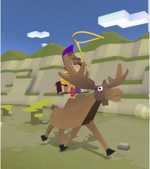
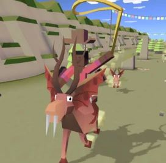
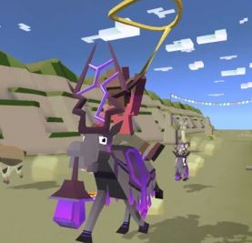
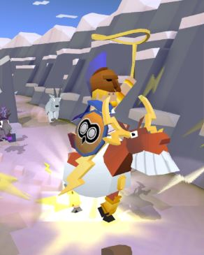
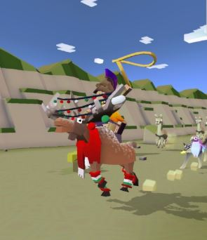

## 산
### 무

+ 업그레이드

      1. 스탬피드 중에 무스의 출현 빈도 3배 증가
      2. 무스에서 점프 거리 증가
      3. 무스를 타는 동안 상자 보상 3배 증가
      4. 무 의 티켓 수익 50% 증가
      5. 독수리 타는 동안 상자 보상 5배 증가
      6. 무스에 착지하면 올가미 밧줄 크기가 줄지 않음
      7. 무스를 타고 장애물 들이받으면 보너스 동전 획득
      8. 스탬피드 중에 희귀 무스의 출현 빈도 2배 증가
      9. 스탬피드에 새로운 희귀 무스 추가
***
+ 특징 : 화가 날 때 위아래로 오르락내리락 한다. 장애물과 동물을 한번 들이받고 사라지며,
일정 시간 후에 다시 생성되는 돌진 상태를 얻는다.
***
+ 종류

  1. 알프스무스  (기본 동물)
      + 사진 : 
      + 설명 : 튼튼한 전천후 짐승입니다. 단단한 뿔로 장애물을 치울 수 있습니다.
      정말로 대머리는 아니고, 곱게 늙어가는 중입니다.
      + 출현거리 : 0m 부터
      + 경험치 획득량 : 0xp
      + 새끼 동물 능력 : 올가미가 7%증가한다.
***
  2. 이끼무스
      + 사진 : 
      + 설명 : 이 건조한 무스는 대체로 사암으로 이루어졌습니다.
      머리에는 사와로 선인장이, 궁둥이에는 페요테 선인장이 자랍니다.
      + 출현거리 : 1300m 부터
      + 경험치 획득량 : 12xp
      + 새끼 동물 능력 : 올가미가 9%더 크게 시작한다, 동물로부터 3%빠르게 9%높게 뛴다.
***
  5. 괴물무스
      + 사진 : 
      + 설명 : 뿔랑켄스타인 박사가 자신의 성의 지하에 있는 비밀 실험실에서 창조해냈습니다.
      트란실바니아의 주요 수출 품목입니다.
      + 출현거리 : 1600m 부터
      + 경험치 획득량 : 25xp
      + 새끼 동물 능력 : 올가미가 12%더 크다, 탄 동물이 12%더 빠르다, 희귀동물 발견 확률이 1% 더 크다.
***
  6. 다크무스
      + 사진 : 
      + 설명 : 고대의 비밀의 수호자. 공허로부터 비전의 힘을 끌어들입니다. 초콜릿으로 만들어졌습니다.
      + 출현거리 : 0m 부터
      + 경험치 획득량 : 3xp
      + 새끼 동물 능력 : 올가미가 8%더 크다, 희귀동물 발견 확률이 10%더 크다.
      + 비밀 동물 : 서로 다른 8 종류의 동물을 겹치지 않고 연속으로 탔을 때 등장한다.
***
  7. 초콜릿 무스
      + 사진 : ![초콜릿 무스(./초콜릿무스.JPG )
      + 설명 : 참으로 맛있어 보이는 색깔의 동물입니다.
      + 출현거리 : 1000m 부터
      + 경험치 획득량 : 12xp
      + 새끼 동물 능력 : 올가미 크기가 8%더 크다, 길들여진 동물이 14%더 빠르다, 길들여진 짝짓기 동물이 14%더 빠르다.
      + 희귀동물 : 레벨 9 업그레이드 후 등장
***
  8. 제우스 무스
      + 사진 : 
      + 설명 : 저건 천둥소리인가요? 아뇨, 좀 더 균형 잡힌 식사가 필요할 뿐입니다.
      + 출현거리 : 1000m 부터
      + 경험치 획득량 : 25xp
      + 새끼 동물 능력 : 올가미가 10%더 크다, 짝짓기 동물이 10%더 높게 나타난다, 화나면 1%더 느리다.
      + 멸종위기종 : 하루에 한번씩 달라지는 멸종위기종을 잡는 시기에 잡을 수 있다
***
  9. 수습 순록
      + 사진 : 
      + 출현거리 : 1000m 부터
      + 설명 : 크리스마스 트리와 충돌하면서 우연히 의상을 갖추었습니다.
      + 경험치 획득량 : 25xp
      + 새끼 동물 능력 : 올가미다 5%더 크다, 올가미다 5%더 느리게 떨어진다, 상자획득시 35%의 추가코인 획득
      + 이벤트동 : 하루에 한번씩 달라지는 멸종위기종을 잡는 시기에 잡을 수 있다.
