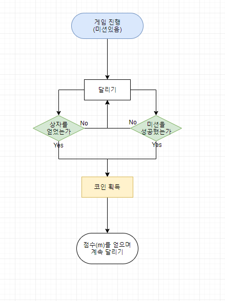

## 게임 플레이
***

### 게임 시작
+ [게임 플레이 순서도](./게임플레이순서도.md)
+ 설명 :
[플레이 용어정리](/원웅/용어정리/플레이_용어정리.md)
 + 기본 조작법 : 방향키 없이 원 터치
   + 화면에 손가락 붙이기 : 동물을 계속 타고 있음

    + 화면에 손가락 떼기 : 타던 동물을 떠나 공중으로 뜸

   + 다시 화면에 손가락 붙이기 : 동물을 바꾸기 성공.

   + 화면을 누른 상태에서 좌우로 움직이며 장애물을 피한다.

   + 

 + 점수 및 코인
     + 동물이 달린 거리(m)를 계산한다. (우측 상단표시)

     + [미션](/원웅/용어정리/미션_용어정리.md)

     + 맵 중간중간의 상자를 얻어 코인 획득

     + 

  + 게임 오버
     + 장애물에 부딪힌 경우

     + 타고있던 [동물](/원웅/용어정리/동물.md)에게 잡아 먹힌경우

     + 캐릭터 체공 상태에서 [장애물](/원웅/용어정리/장애물.md) 에 부딪힌 경우

     + 캐릭터 체공 상태에서 동물을 갈아타지 못한경우

     + 
