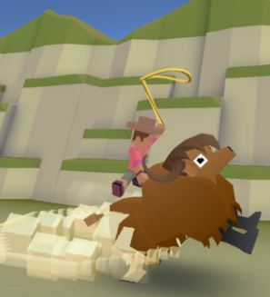
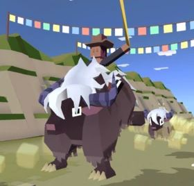
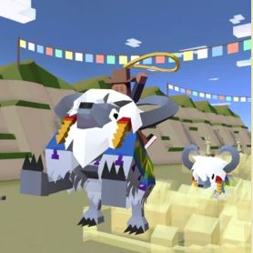
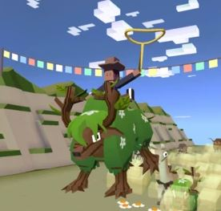
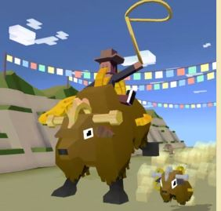
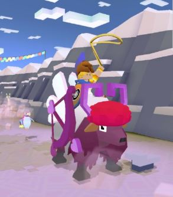
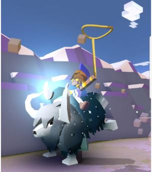

## 산
### 야크

+ 업그레이드

      1. 스탬피드 중에 야크의 출현 빈도 2배 증가
      2. 야크의 차분한 상태 2초 연장
      3. 야크가 바위를 들이받을 수 있음
      4. 야크의 티켓 수익 50% 증가.
      5. 야크에서 점프 거리 증가.
      6. 야크 탈 때 속도 증가.
      7. 야크로 장애물 들이받으면 보너스 동전 획득.
      8. 스탬피드 중에 희귀 야크의 출현 빈도 2배 증가
      9. 스탬피드에 새로운 희귀 야크 추가
***
+ 특징 : 화가 날 때 점점 빠른 속도로 달린다. 탑승 시 콩콩 뛴다.
바위를 제외한 장애물과 동물들을 들이받을 수 있다.
***
+ 종류

  1. 야크  (기본 동물)
      + 사진 : 
      + 설명 : 중앙 아시아 남부에 서식하는 장모종 소과 동물.
거대하면서도 온순하지만 닿는 모든 것을 박살내는 경향이 있습니다.
      + 출현거리 : 0m 부터
      + 경험치 획득량 : 0xp
      + 새끼 동물 능력 : 화나면 5%느려진다.
***
  2. 스컹야크
      + 사진 : 
      + 설명 : 스컹크보다 열 배는 큰 덩치에 백 배는 더 지독한 냄새를 풍깁니다. 꽉 끌어안기를 좋아합니다.
      + 출현거리 : 200m 부터
      + 경험치 획득량 : 1xp
      + 새끼 동물 능력 : 화나면 5%느려진다, 탄 동물이 15%더 빠르다.
***
  3. 무서운 설야크
      + 사진 : 
      + 설명 : 산소 없이 에베레스트를 등반한 야크 중 세 번째로 젊습니다.
      + 출현거리 : 800m 부터
      + 경험치 획득량 : 4xp
      + 새끼 동물 능력 : 화나면 8%느려진다, 희귀동물확률 4%증가, 동물이 5%더 작다.
***
  4. 옹이야크 나무
      + 사진 : 
      + 설명 : 세상에서 가장 성질이 거칠고 나쁜 식물 덩어리입니다.
      다른 늑대들은 이상하게 생각하지만 개인의 취향은 존중합시다.
      + 출현거리 : 1300m 부터
      + 경험치 획득량 : 12xp
      + 새끼 동물 능력 : 화나면 6%느려진다, 탄동물이 8%더 느리다.
***
  5. 배틀 야크
      + 사진 : 
      + 설명 : 날 때부터 전쟁을 위해 훈련된 전투 병기입니다. 젖에서는 승리의 맛이 납니다.
      + 출현거리 : 1800m 부터
      + 경험치 획득량 : 25xp
      + 새끼 동물 능력 : 올가미크기가 8%더 크다, 길들여진 동물이 20%더빠르다, 화나면 1%느려진다.
***
  6. 기어펑크 야크
      + 사진 : 
      + 설명 : 최대 전투력을 위해 정밀하게 설계되었습니다. 태엽 장치처럼 정확하게 작동하지만 가끔 느슨해질 필요도 있습니다.
      + 출현거리 : 0m 부터
      + 경험치 획득량 : 10xp
      + 새끼 동물 능력 : 올가미가 7%더 크다, 상자획득시 35%추가 코인, 길들인 동물 7% 빠름.
      + 비밀 동물 : 올가미가 12%느리게 가라앉는다, 화나면 6%느려진다.
***
  7. 아프로디지 야크
      + 사진 : 
      + 설명 : 보기만 해도 사랑에 빠지게 만드는 동물입니다.
      + 출현거리 : 1300m 부터
      + 경험치 획득량 : 12xp
      + 새끼 동물 능력 : 화나면 7%느려진다, 짝동물 발견확률이 10% 증가한다, 길들여진 동물이 1%더 빠름.
      + 희귀동물 : 레벨 9 업그레이드 후 등장
***
  8. 조디야크
      + 사진 : 
      + 설명 : 별자리가 황소자리인 야크로, 점성술에 푹 빠져서 종종 하늘을 보며 생각에 잠기곤 합니다.
      + 출현거리 : 1300m 부터
      + 경험치 획득량 : 25xp
      + 새끼 동물 능력 : 화나면 8% 느려진다, 미션수행시 12%추가 코인 획득, 동물이 10%더 작다.
      + 멸종위기종 : 하루에 한번씩 달라지는 멸종위기종을 잡는 시기에 잡을 수 있다.
***
  9. 쿼터_야크
      + 사진 : 
      + 설명 : 다리가 더 많으면 미식축구 할 때 확실히 유리해요.
      + 출현거리 : 1300m 부터
      + 경험치 획득량 : 4xp
      + 새끼 동물 능력 : 화나면 10%더 느려진다, 10%더 높게 점프한다.
      + 이벤트동물 : 2주년 기념 이벤트
