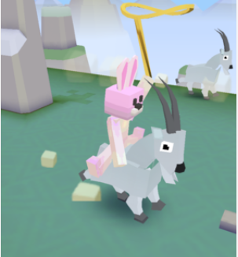
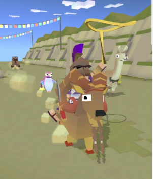
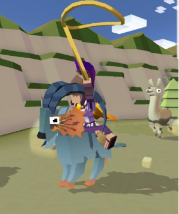
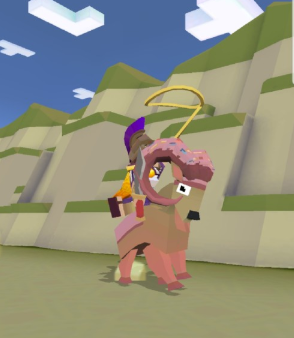
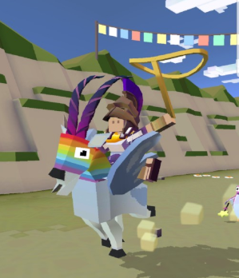
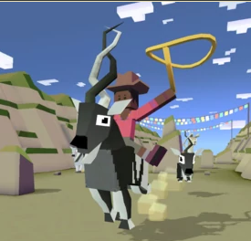
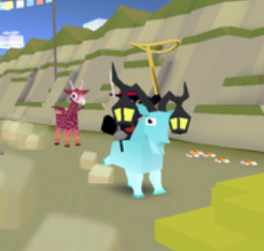

## 산
### 염소

+ 업그레이드

      1. 염소의 차분한 상태 2초 연장
      2. 화난 염소의 몸부림 위력 감소
      3. 염소 몸부림치면서 다른 동물 밀어냄
      4. 염소의 티켓 수입 50% 증가
      5. 공중에 있을 때 염소가 올가미 밧줄로 다가옴
      6. 염소의 차분한 상태 1초 연장
      7. 염소가 몸부림칠 때 보너스 동전 획득
      8. 스탬피드 중에 희귀 염소의 출현 빈도 2배 증가
      9. 스탬피드에 새로운 희귀 염소 추가
***
+ 종류

  1. 산염소 (기본 동물)
      + 사진 : 
      + 설명 : 신경질적이지만 제설차만큼 든든하지요. 자주 기절하곤 합니다.
      + 출현거리 : 0m 부터
      + 경험치 획득량 : 0xp
      + 새끼 동물 능력 : 동물이 7%더 작아진다.
***
  2. 바이킹 염소
      + 사진 : 
      + 설명 : 오늘 밤, 발할라에서 모두 다 씹어주마!
      + 출현거리 : 1000m 부터
      + 경험치 획득량 : 1xp
      + 새끼 동물 능력 : 미션 수행시 6%코인 추가획득, 동물이 10%더 작아진다.
      ***
  3. 아쿠아염소
      + 사진 : 
      + 설명 : 아쿠아염소. 아쿠아염소가 보통 할 만한 짓을 합니다...
      + 출현거리 : 1600m 부터
      + 경험치 획득량 : 4xp
      + 새끼 동물 능력 : 4%더 높게 뛴다, 물에서 8%더 빠르다, 동물이 8%더 작다.
      ***
  4. 미치광이염소
      + 사진 : 
      + 설명 : 이 장난꾸러기 동물은 모종의 이유로 경찰의 수배를 받고 있습니다.
      + 출현거리 :2000m 부터
      + 경험치 획득량 : 12xp
      + 새끼 동물 능력 : 짝짓기동물이 10%더 빠르다.
      ***
  5. 스텔스염소마크2
      + 사진 : 
      + 설명 : 이 염소가 이미 시야에 들어온 순간 이미 늦은 겁니다...
      + 출현거리 : 2500m 부터
      + 경험치 획득량 : 25xp
      + 새끼 동물 능력 : 상자에서 15%코인을 더 준다, 동물이 16%작아진다, 올가미 1% 크게시작
      ***
  6. 이각수
      + 사진 : 
      + 설명 : 뿔이 두 개라 두 배 더 멋지다는 것은 다들 인정합니다.
      + 출현거리 : 2500m 부터
      + 경험치 획득량 : 25xp
      + 새끼 동물 능력 : 희귀동물 발견확률 8%증가, 짝짓짓기 동물 발견확률 6%증가, 동물이 8%더 작다.
      + 보스 동물 : 일정양의 미션을 클리어 후 보스 미션에서 등장.
      ***
  7. 이형접합염소체
      + 사진 : 
      + 설명 : 비대립 형질입니다.
      + 출현거리 : 2000m 부터
      + 경험치 획득량 : 12xp
      + 새끼 동물 능력 : 올가미가 10%낮게 가라앉음, 동물이 12% 작다.
      + 희귀동물 : 레벨 9 업그레이드 후 등장
      ***
  8. 고스트
      + 사진 : 
      + 설명 : 저승에서 돌아온 메신져... 별점 5개 - 특급 배송.
      + 출현거리 :2000m 부터
      + 경험치 획득량 : 12xp
      + 새끼 동물 능력 : 탄 동물이 12%더 빠르다, 점프를 8%더 높게한다, 동물이 8%더 작다.
