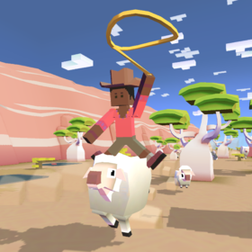
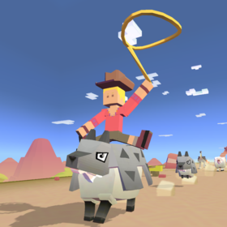
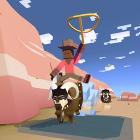
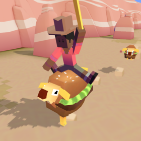
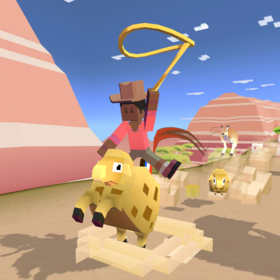

## 오지
### 양

+ 업그레이드

      1. 양의 차분한 상태 2초 연장.
      2. 공중에 있을 때 양이 올가미 밧줄로 다가옴.
      3. 화난 양의 몸부림 위력 감소.
      4. 양의 티켓 수익 50% 중가.
      5. 양에 착지하면 밧줄 크기가 줄지 않음.
      6. 양을 탈때 앞에 있는 다른 양들을 밀쳐냄.
      7. 양이 몸부림칠 때 보너스 동전 획득.
      8. 스탬피드 중에 희귀 양의 출현 빈도 2배 증가.
      9. 스탬피드에 새로운 희귀 양 추가.

+ 종류

  1. 메리나 양 (기본 동물)
      + 사진 : 
      + 설명 : 최고급 양모를 생산하기 위해 개량된 종입니다.
조사원들이 수를 세러 갔다가 모두 잠에 드는 바람에 개체수는 미상입니다.
      + 출현거리 : 0m 부터
      + 경험치 획득량 : 0xp
      + 새끼 능력 : 동물 길들이는 속도 12% 증가

  2. 늑대 탈을 쓴 양
      + 사진 : 
      + 설명 : 사냥의 전리품을 착용한 용사이거나 애기 옷을 입고 있는 장난꾸러기 둘 중 하나입니다...
      + 출현거리 : 200m 부터
      + 경험치 획득량 : 1xp
      + 새끼 능력 : 타고 있는 동물의 속도 6% 증가, 동물 위에서 점프 속도 3% 증가, 동물 길들이는 속도 15% 증가
  3. 사탕 양
      + 사진 : 
      + 설명 : 달콤한 솜사탕 덩어리. 무리의 다른 양들이 자꾸 핥곤 하지요.
      + 출현거리 : 800m 부터
      + 경험치 획득량 : 4xp
      + 새끼 능력 : 동물 사냥 효과 9% 증가, 동물 길들이는 속도 12% 증가, 희귀동물 출현 7% 증가
  4. 레이디 매애매애
      + 사진 : 
      + 설명 : 내 양모엔 아무도 손댈 수 없어.
      + 출현거리 : 1300m 부터
      + 경험치 획득량 : 12xp
      + 새끼 능력 : 동물 길들이는 속도 20% 증가, 짝짓기 동물 출현 20% 증가, 짝짓기 동물 길들이는 속도 5% 증가
  5. 양치기 아가씨
      + 사진 : 
      + 설명 : 중년의 위기가 다가와 상실감에 빠졌는데 어떻게 정신을 차릴지 통 알 수가 없습니다...
      + 출현거리 : 1800m 부터
      + 경험치 획득량 : 25xp
      + 새끼 능력 : 동물 화나는 속도 8% 감소, 짝짓기 동물 길들이는 속도 20% 증가, 동물 길들이는 속도 2% 증가
  6. 코난 더 매애매애리안
      + 사진 : 
      + 설명 : 위풍당당한 채식주의자.
      + 출현거리 : 1800m 부터
      + 경험치 획득량 : 25xp
      + 새끼 능력 : 시작 시 밧줄 크기 8% 증가, 동물 위에서 점프 높이 8%증가, 동물 길들이는 속도 20% 증가
      + 보스 동물 : 일정양의 미션을 클리어 후 보스 미션에서 등장.
  7. 양보르기니
      + 사진 : 
      + 설명 : 양의 최고 기록을 달성한 패스트푸드.
      + 출현거리 : 1300m 부터
      + 경험치 획득량 : 12xp
      + 새끼 능력 : 타고 있는 동물의 속도 10% 증가, 동물 사냥 효과 10% 증가, 동물 길들이는 속도 15% 증가
      + 희귀동물 : 레벨 9 업그레이드 후 등장
  8. 양망베르 치즈
      + 사진 : 
      + 설명 : 전통적인 프랑스풍 농장의 양으로 부드럽고 매끈한 질감과 고소하고 풍부한 풍미를 지녔습니다.
      + 출현거리 : 800m 부터
      + 경험치 획득량 : 25xp
      + 새끼 능력 : 타고 있는 동물의 속도 5% 감소, 동물 길들이는 속도 25% 증가, 미션으로 획득하는 동전 10% 증가
      + 멸종위기종 : 하루에 한번씩 달라지는 멸종위기종을 잡는 시기에 잡을 수 있다.
