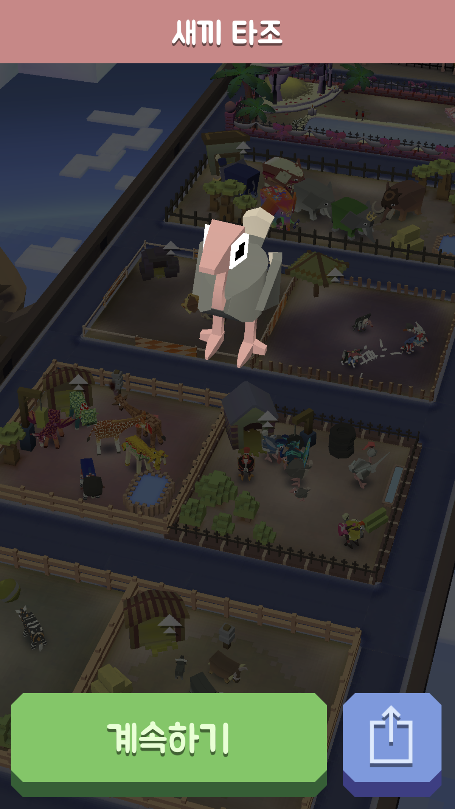

# 동물 우리

### 우리 업그레이드
  + 골드를 통해 각 동물의 우리를 업그레이드 하여 새로운 능력을 추가시킬수 있다.
  + 해당 동물의 카테고리에 가서 내용을 확인할 수 있다.
### 동물 숙련도
  + 게임 플레이시 각 동물에 탑승할 시 경험치를 얻는데 일정 수준이 되면 숙련도가 오른다.
  + 숙련도가 오를시 새로운 모자(= 코스튬)을 준다.
  + 각 단계는 초보, 목동, 선수로 구성되어있다.
  + 초보 0~25xp
  + 목동 0~150xp
  + 선수 0~600xp
### 동물 컬렉션
  + 게임을 플레이하며 다양한 동물을 길들일 수 있는데, 길들인 동물들을 확인할 수 있다.
  + 동물들을 길들일 때 찍힌 사진과 동물 별로 설명을 확인 할 수 있다.
  + 길들인 동물 중 하나를 선택하여 스타팅 동물을 정할 수 있다.  
  + 동물들의 종류는 해당 동물의 카테고리에 가서 확인할 수 있다.
### 새끼 동물 컬렉션
  + 이미 길들인 동물에 한에서 게임을 플레이 하여 동물을 번식할 수 있다.
  + 번식 우리에서 따로 번식을 시킬 수 있고 1쌍의 동물만 번식이 가능하다.
  + 일정 시간이 지나거나 골드를 사용하여 번식을 완료할 수 있다.
  + 번식이 완료되면 새끼 동물이 태어난다.
  + 새끼 동물들은 종류에 따라 다른 능력을 갖고있고 플레이시 함께 달려 플레이어에게 도움을 줄 수 있다.(잠재적 능력은 보유만 해도 능력이 적용된다.)
  + 각 새끼 동물들의 능력은 해당 동물의 카테고리에 가서 확인할 수 있다.
  + 새끼동물 번식 완료 사진 
