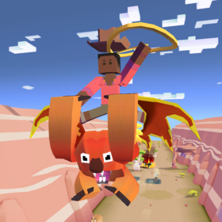

## 오지
### 드롭베어

+ 업그레이드

      1. 스탬피드 중에 웜뱃의 출현 빈도 2배 증가
      2. 동물 사냥 시 드롭베어의 행복 상태 더 오래 지속
      3. 드롭베어 타고 장애물 뛰어넘을 때 공중에 떠 있는 시간 증가
      4. 드롭베어의 티켓 수익 50% 증가
      5. 점프 중에 올가미 밧줄 크기 증가
      6. 타고 있는 드롭베어의 점프/공격 범위 증가
      7. 드롭베어 타고 다른 동물 사냥 시 보너스 동전 획득
      8. 스탬피드 중에 희귀 드롭베어의 출현 빈도 2배 증가
      9. 스탬피드에 새로운 희귀 드롭베어 추가
***
+ 특징 : 화가 날 때 플레이어를 먹어버린다.

      등장 시 나무 위에서 뛰어내려 플레이어에게 부딪힌다.
      동물이 아닌 장애물에 부딪혔을 때 점프해서 장애물을 넘고,
      지속적으로 블럭을 부술 수 있는 동물들을 제외한 모든 동물을 사냥할 수 있다.
***
+ 종류

  1. 드롭베어 (기본 동물)
      + 사진 : 
      + 설명 : 나무나 바위에서 뛰어내려 아무것도 모르는 관광객들을 덮치는 공격적인 육식성 유대목 생물.
      + 출현거리 : 0m 부터
      + 경험치 획득량 : 0xp
      + 새끼 동물 능력 : 불타는 속도 8% 감소, 희귀동물 출현 4% 증가
***
  2. 드롭베어 던디
      + 사진 : 
      + 설명 : 취미로 악어와 씨름합니다.
      + 출현거리 : 500m 부터
      + 경험치 획득량 : 1xp
      + 새끼 동물 능력 : 동물의 수중 이동 속도 15% 증가, 불타는 속도 8% 감소, 희귀동물 출현 4% 증가
***
  3. 드롭 바이키
      + 사진 : 
      + 설명 : 코알라 전체를 망신시키는 1%의 코알라.
      + 출현거리 : 1200m 부터
      + 경험치 획득량 : 4xp
      + 새끼 동물 능력 : 밧줄 작아지는 속도 12% 감소, 불타는 속도 12% 감소, 희귀동물 출현 4% 증가
***
  4. 구두쇠 코알라
      + 사진 : 
      + 설명 : 풍선 줄까?
      + 출현거리 : 1600m 부터
      + 경험치 획득량 : 12xp
      + 새끼 동물 능력 : 동물 위에서 점프 속도 10% 증가, 불타는 속도 16% 감소, 동물 길들이는 속도 16% 증가

***
  5. 러셀 코
      + 사진 : 
      + 설명 : 검투사 코알라.
      + 출현거리 : 2200m 부터
      + 경험치 획득량 : 25xp
      + 새끼 동물 능력 : 불타는 속도 20% 감소, 희귀동물 출현 10% 증가, 짝짓기 동물 출현 1% 증가
***
  6. 괴수드롭베어
      + 사진 : 
      + 설명 : 호숫가를 어슬렁거리며 밤에 사냥하는 거대한 코알라. 차가운 맥주와 불에 지진 소시지를 즐깁니다.
      + 출현거리 : 2000m 부터
      + 경험치 획득량 : 6xp
      + 새끼 동물 능력 : 미션으로 획듣하는 동전 15% 증가, 희귀동물 출현 8% 증가, 상자에서 획득하는 동전 3% 증가(Passive)
      + 비밀동물 : 오지에서 2000m 이상 진행시 일정한 확률로 불타는 나무 위에 앉아있음.
***
  7. 드롭베어 영애
      + 사진 : 
      + 설명 : 드롭베어 경의 영애로 엘리자베스 드롭베어 2세의 먼 친척입니다.
      + 출현거리 : 1600m 부터
      + 경험치 획득량 : 12xp
      + 새끼 동물 능력 : 시작 시 밧줄 크기 8% 증가, 불타는 속도 40% 감소, 희귀동물 출현 6% 증가
      + 희귀동물 : 레벨 9 업그레이드 후 등장
***
  8. 드롭베어 교수
      + 사진 : 
      + 설명 : 수업 중에 졸면 큰일 납니다...
      + 출현거리 : 1300m 부터
      + 경험치 획득량 : 25xp
      + 새끼 동물 능력 : 동물 위에서 점프 높이 5% 증가, 불타는 속도 20% 감소, 희귀동물 출현 12% 증가
      + 멸종위기종 : 하루에 한번씩 달라지는 멸종위기종을 잡는 시기에 잡을 수 있다.
