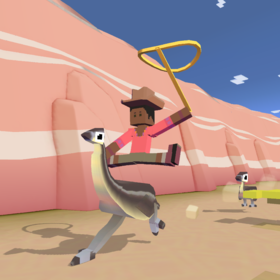
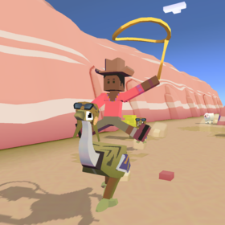
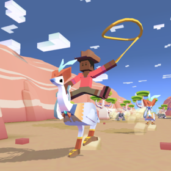
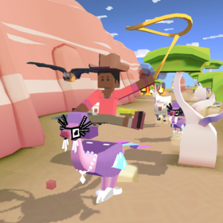
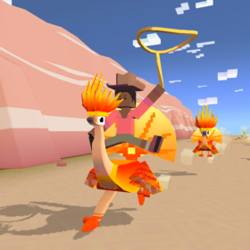
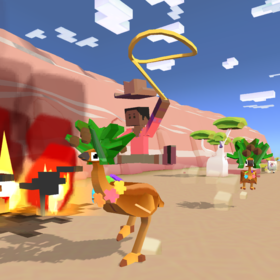
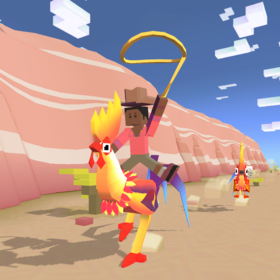

## 오지
### 에뮤

+ 업그레이드

      1. 스탬피드 중에 에뮤의 출현 빈도 2배 증가
      2. 에뮤의 차분한 상태 2초 연장
      3. 에뮤 타는 동안 불타는 속도 감소
      4. 에뮤의 티켓 수익 50% 증가
      5. 질주 중에 충돌하면 에뮤가 던져버림
      6. 에뮤에서 점프 거리 증가
      7. 최고 속도로 에뮤 탈 때 보너스 동전 획득
      8. 스탬피드 중에 희귀 에뮤의 출현 빈도 2배 증가
      9. 스탬피드에 새로운 희귀 양 추가

***
+ 특징 : 화가 날 때 점점 빠른 속도로 달린다.
***
+ 종류

  1. 에뮤 (기본 동물)
      + 사진 : 
      + 설명 : 부드러운 깃털을 가진 날지 못하는 새. 암컷이 알을 낳으면 수컷이 품어서 부화시키고 기릅니다.
      + 출현거리 : 0m 부터
      + 경험치 획득량 : 0xp
      + 새끼 동물 능력 : 타고있는 동물의 속도 4% 증가, 동물 위에서 점프 높이 4% 증가
***
  2. 비행사 에뮤
      + 사진 : 
      + 설명 : 태생적인 한계를 뛰어넘기로 작정하였습니다.
      + 출현거리 : 500m 부터
      + 경험치 획득량 : 1xp
      + 새끼 동물 능력 : 타고있는 동물의 속도 6% 증가, 날짐승 급강하 속도 8% 감소, 시작시 밧줄 크기 1% 증가(Passive)
***
  3. 사춘기 에뮤
      + 사진 : 
      + 설명 : 피도 눈물도 없는 무심한 세상에 대해 한탄하지만 명품 스키니 청바지가 아주 잘 어울립니다
      + 출현거리 : 1000m 부터
      + 경험치 획득량 : 4xp
      + 새끼 동물 능력 : 동물 화나는 속도 6% 감소, 타고있는 동물의 속도 4% 증가, 동물 길들이는 속도 14% 증가
***
  4. 에뮤지션
      + 사진 : 
      + 설명 : 자수성가형 스타. 데뷔작인 새의 노래는 전 세계의 차트를 휩쓸었습니다.
      + 출현거리 : 1600m 부터
      + 경험치 획득량 : 12xp
      + 새끼 동물 능력 : 타고있는 동물의 속도 5% 증가, 희귀 동물 출현 8% 증가, 짝짓기 동물 출현 12% 증가

***
  5. 데임 에뮤
      + 사진 : 
      + 설명 : 원래 촌뜨기 새였다가 연예 토크쇼의 대스타가 되었는데, 사실 매니저의 공이 큽니다.
      + 출현거리 : 2200m 부터
      + 경험치 획득량 : 25xp
      + 새끼 동물 능력 : 타고있는 동물의 속도 7% 증가, 상자에서 획득하는 동전 25% 증가, 미션으로 획득하는 동전 20% 증가
***
  6. 불사에뮤
      + 사진 : 
      + 설명 : 재에서 일어나 날개를 펼치고는... 땅 위를 걸어다닙니다.
      + 출현거리 : 2200m 부터
      + 경험치 획득량 : 25xp
      + 새끼 동물 능력 : 밧줄 작아지는 속도 12% 감소, 동물 위에서 점프 속도 9% 증가, 불타는 속도 3% 감소(Passive)
      + 보스 동물 : 일정양의 미션을 클리어 후 보스 미션에서 등장.
***
  7. 열대에뮤
      + 사진 : 
      + 설명 : 에뮤와 코코넛을 같이 두면 에뮤와 코코넛이 기분을 좋아지게 하지요.
      + 출현거리 : 1600m 부터
      + 경험치 획득량 : 12xp
      + 새끼 동물 능력 : 시작시 밧줄 크기 10% 증가, 동물 화나는 속도 8% 감소, 짝짓기 동물 길들아는 속도 14% 증가
      + 희귀동물 : 레벨 9 업그레이드 후 등장
***
  8. 꼬끼오에뮤
      + 사진 : 
      + 설명 : 12년에 한 번 별자리가 일치할 때만 한 번 우는 닭입니다.
      + 출현거리 : 1600m 부터
      + 경험치 획득량 : 25xp
      + 새끼 동물 능력 : 타고있는 동물의 속도 6% 증가, 동물 위에서 점프 높이 7% 증가, 희귀동물 출현 9% 증가
      + 멸종위기종 : 하루에 한번씩 달라지는 멸종위기종을 잡는 시기에 잡을 수 있다.
