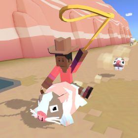
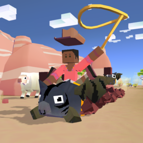

## 오지
### 웜뱃

+ 업그레이드

      1. 스탬피드 중에 웜뱃의 출현 빈도 2배 증가
      2. 웜뱃에서 점프 거리 증가
      3. 웜뱃에서 점프하면 일시적으로 올가미 밧줄 크기 20% 증가
      4. 웜뱃의 티켓 수익 50% 증가
      5. 웜뱃 타고 땅속에 있을 때 방향 전환 속도 증가
      6. 공중에 있을 때 웜뱃이 올가미 밧줄로 다가옴
      7. 웜뱃 타고 땅 속에 있을 때 보너스 동전 획득
      8. 스탬피드 중에 희귀 웜뱃의 출현 빈도 2배 증가
      9. 스탬피드에 새로운 희귀 웜뱃 추가

***
+ 특징 : 화가 날 때 땅 속에 들어간다. 땅 속에 들어가면 불에 피해를 입지 않으며, 장애물이나 동물과 충돌 시 밖으로 나오게 된다.
***
+ 종류

  1. 웜뱃 (기본 동물)
      + 사진 : 
      + 설명 : 낯을 가리고 텃세가 심한 야행성 동물로, 대부분의 시간을 땅굴을 파며 지냅니다.
      + 출현거리 : 0m 부터
      + 경험치 획득량 : 0xp
      + 새끼 동물 능력 : 동물 위에서 점프 속도 6% 증가
***
  2. 전투웜뱃
      + 사진 : 
      + 설명 : 땅 파는 데 일가견이 있으며 고도의 훈련을 받은 웜뱃 전문가로, 온갖 참호전에 잔뼈가 굵습니다.
      + 출현거리 : 500m 부터
      + 경험치 획득량 : 1xp
      + 새끼 동물 능력 : 동물 위에서 점프 속도 12% 증가, 상자에서 획득하는 동전 20% 증가
***
  3. 웜캣
      + 사진 : 
      + 설명 : 쥐 따위를 쫓자니 자존심이 너무 세고, 놀자니 너무 지루하고, 쉬자니 너무 배고프고, 걱정하자니 너무 게으릅니다. 땅이나 파는 게 답이죠.
      + 출현거리 : 750m 부터
      + 경험치 획득량 : 4xp
      + 새끼 동물 능력 : 동물 화나는 속도 5% 감소, 동물 위에서 점프 속도 7% 증가, 동물 위에서 점프 높이 7% 증가
***
  4. 웜베이비
      + 사진 : 
      + 설명 : 다 자란 웜뱃 중에는 어린 시절의 귀여움을 고스란히 간직하여 그것을 이용해 평생 놀고 먹는 개체도 있지요.
      + 출현거리 : 1300m 부터
      + 경험치 획득량 : 12xp
      + 새끼 동물 능력 : 시작시 밧줄 크기 8% 증가, 동물 위에서 점프 속도 6% 증가, 짝짓기 동물 출현 14% 증가

***
  5. 웜드리안
      + 사진 : 
      + 설명 : 이 조그만의 예술적 천재는 추상화, 축소, 그리고 dirt를 통해 전 세계적인 형태를 만든다.
      + 출현거리 : 1800m 부터
      + 경험치 획득량 : 25xp
      + 새끼 동물 능력 : 동물 위에서 점프 속도 8% 증가, 미션으로 획득하는 동전 20% 증가, 짝짓기 동물 길들이는 속도 10% 증가
***
  6. 봄뱃
      + 사진 : 
      + 설명 : 일반적인 굴삭이 안 통할 때는 이 철거 전문가를 부르세요!
      + 출현거리 : 0m 부터
      + 경험치 획득량 : 3xp
      + 새끼 동물 능력 : 동물 위에서 점프 속도 7% 증가, 불타는 속도 25% 감소, 동물 길들이는 속도 14% 증가
      + 보스 동물 : 일정양의 미션을 클리어 후 보스 미션에서 등장.
***
  7. 웜바멜론
      + 사진 : 
      + 설명 : 멸종 위기에 처했지만 너무 맛있습니다! 여름날 무더위에 특히 시원하고 청량하죠...
      + 출현거리 : 1300m 부터
      + 경험치 획득량 : 12xp
      + 새끼 동물 능력 : 타고있는 동물의 속도 12% 증가, 동물 위에서 점프 속도 8% 증가, 불타는 속도 4% 감소(Passive)
      + 희귀동물 : 레벨 9 업그레이드 후 등장
***
  8. 웜배트맨
      + 사진 : 
      + 설명 : 날지는 못하지만 멋진 가면과 가짜 만능 허리띠를 가지고 있습니다.
      + 출현거리 : 1300m 부터
      + 경험치 획득량 : 12xp
      + 새끼 동물 능력 : 밧줄 작아지는 속도 8% 감소, 동물 위에서 점프 속도 10% 증가, 동물 위에서 점프 높이 4% 증가, 미션으로 획득하는 동전 20% 증가
