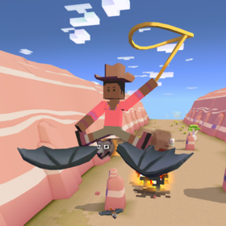
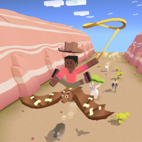
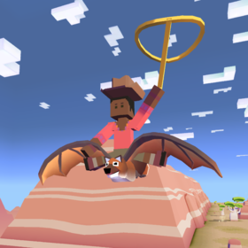
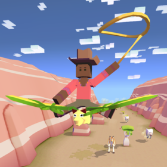
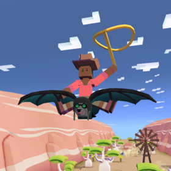

## 오지
### 큰박쥐

+ 업그레이드

      1. 스탬피드 중에 큰박쥐의 출현 빈도 2배 증가
      2. 큰박쥐의 차분한 상태 1초 연장
      3. 큰박쥐에서 점프하면 일시적으로올가미 밧줄 크기 20% 증가
      4. 큰박쥐의 티켓 수익 50% 증가.
      5. 큰박쥐 타는 동안 불타는 속도 감소
      6. 큰박쥐의 차분한 상태 1초 연장
      7. 큰박쥐를 타고 급강하 시 보너스 동전 획득
      8. 스탬피드 중에 희귀 큰박쥐의 출현 빈도 2배 증가
      9. 스탬피드에 새로운 희귀 큰박쥐 추가

***
+ 특징 : 화가 날 때 위아래로 오르락내리락 한다.

        야생 상태에서 천천히 앞으로 날아간다.
***
+ 종류

  1. 큰박쥐 (기본 동물)
      + 사진 : 
      + 설명 : 날개폭이 최대 1.7미터인 거대한 박쥐. 과일, 꽃가루, 꿀과 관심을 먹고 삽니다.
      + 출현거리 : 0m 부터
      + 경험치 획득량 : 0xp
      + 새끼 동물 능력 : 밧줄 작아지는 속도 6% 감소, 날 짐승 급강속도 3% 감소
***
  2. 비행상자
      + 사진 : 
      + 설명 : 골판지와 포장용 테이프를 조합하면 공기역학의 걸작이 탄생하지요!
      + 출현거리 : 200m 부터
      + 경험치 획득량 : 1xp
      + 새끼 동물 능력 : 밧줄 작아지는 속도 9% 감소, 날 짐승 급강속도 4% 감소, 상자에서 획득하는 동전 25% 증가
***
  3. 큰박쥐여우
      + 사진 : 
      + 설명 : 너무 고지식한 것이 탈입니다.
      + 출현거리 : 750m 부터
      + 경험치 획득량 : 4xp
      + 새끼 동물 능력 : 밧줄 작아지는 속도 10% 감소, 동물 위에서 점프 높이 6% 증가, 날 짐승 급강속도 6% 감소
***
  4. 흡혈박쥐
      + 사진 : 
      + 설명 : 빨대를 꽃고 다니지요.
      + 출현거리 : 1300m 부터
      + 경험치 획득량 : 12xp
      + 새끼 동물 능력 : 타고있는 동물의 속도 6% 감소, 동물 길들이는 속도 15% 증가, 밧줄 작아지는 속도 1% 감소(Passive)

***
  5. 과일박쥐
      + 사진 : 
      + 설명 : 다양한 과일 향이 나는 비행 동식물입니다!
      + 출현거리 : 1800m 부터
      + 경험치 획득량 : 25xp
      + 새끼 동물 능력 : 밧줄 작아지는 속도 10% 감소, 동물 사냥 효과 10% 증가, 날 짐승 급강속도 8% 감소
***
  6. 감시박쥐
      + 사진 : 
      + 설명 : 목표물 주시. 탐스럽게 익은 망고 확인. 공격을 개시해도 되겠습니까?
      + 출현거리 : 0m 부터
      + 경험치 획득량 : 5xp
      + 새끼 동물 능력 : 밧줄 작아지는 속도 8% 감소, 미션으로 획득하는 동전 16% 증가, 희귀동물 출현 6% 증가
      + 비밀 동물 : 오지 맵을 모두 연 후, 풍차 또는 지붕이 있는 집을 들이받아 부수면 등장한다.
***
  7. 비행양말
      + 사진 : 
      + 설명 : 자연이 이룬 기적으로, 양말이 짝짝이가 아닙니다.
      + 출현거리 : 1300m 부터
      + 경험치 획득량 : 12xp
      + 새끼 동물 능력 : 밧줄 작아지는 속도 8% 감소, 날 짐승 급강속도 6% 감소, 짝짓기 동물 길들이는 속도 12% 증가

***
  8. 귀여운박쥐
      + 사진 : 
      + 설명 : 이 아기 같이 생긴 '아름다운 박쥐'는 하루 종일 스파를 떠나지 않습니다.
      + 출현거리 : 1300m 부터
      + 경험치 획득량 : 25xp
      + 새끼 동물 능력 : 밧줄 작아지는 속도 8% 감소, 날 짐승 급강속도 6% 감소, 짝짓기 동물 길들이는 속도 12% 증가, 짝짓기 동물 길들이는 속도 2% 증가(Passive)
      + 멸종위기종 : 하루에 한번씩 달라지는 멸종위기종을 잡는 시기에 잡을 수 있다.
