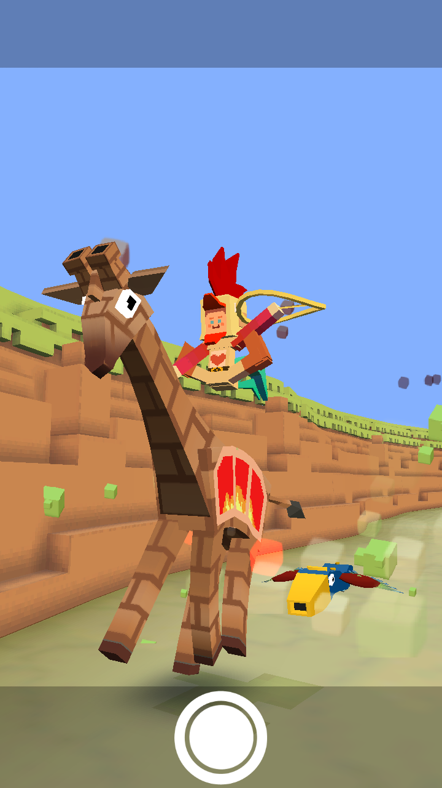
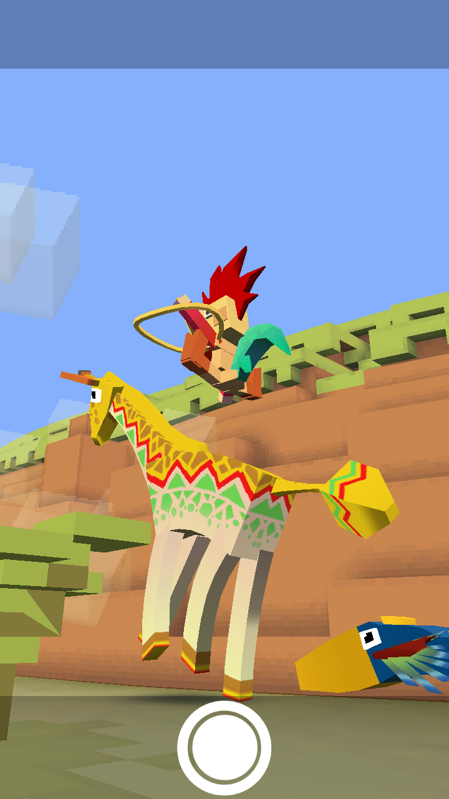
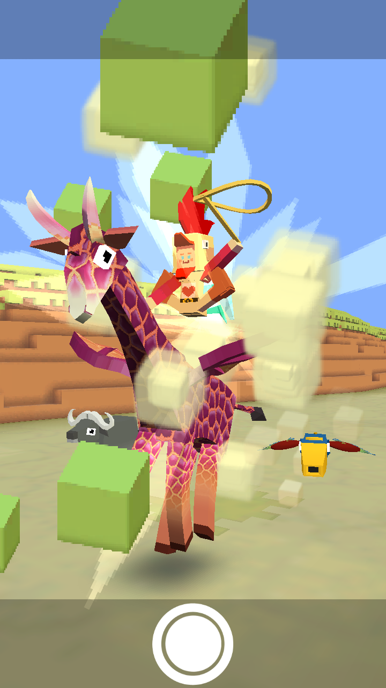
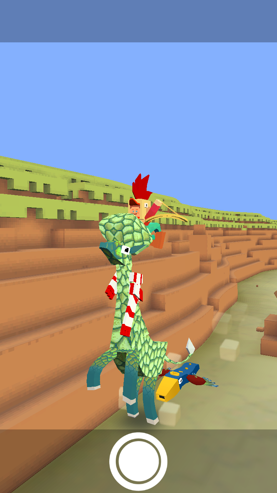
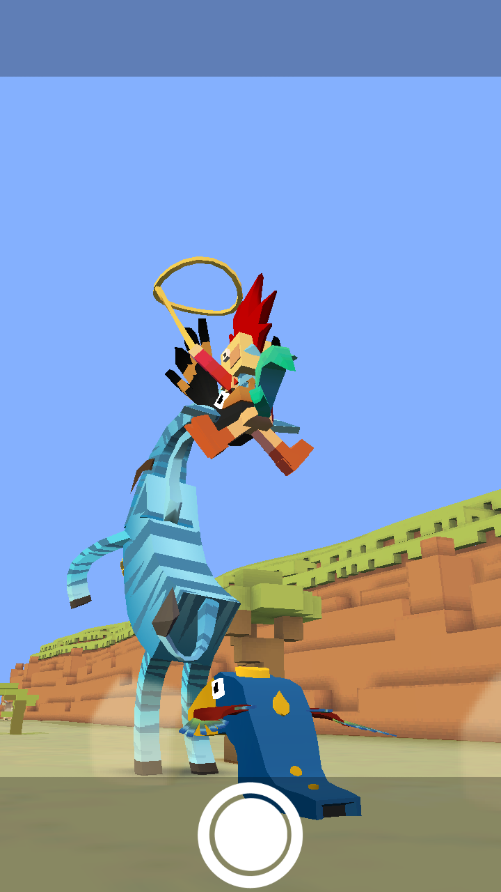
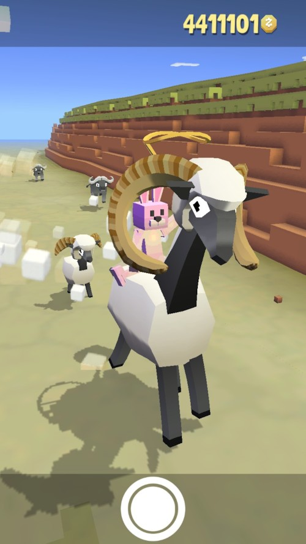
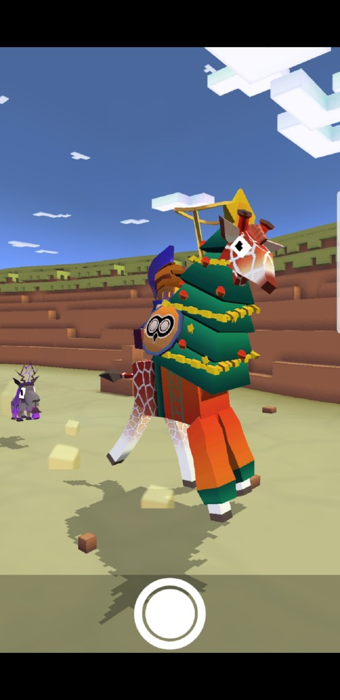

## 사바나
### 기린
+ 업그레이드

      1. 스탬피드 중에 기린의 출현 빈도 3배 증가
      2. 기린에서 점프하면 일시적으로 올가미 밧줄 크기 20% 증가
      3. 기린은 작은 충돌 시 비틀거리다 회복함
      4. 기린의 티켓 수익 50% 증가.
      5. 기린에서 점프 거리 증가
      6. 기린에서 점프하면 일시적으로 올가미 밧줄 크기 20% 증가
      7. 기린에서 멀리 점프하면 보너스 동전 획득
      8. 스탬피드 중에 희귀 기린의 출현 빈도 2배 증가
      9. 스탬피드에 새로운 희귀 기린 추가

***
+ 특징 : 화가 날 때 플레이어를 멀리 던져버린다. 키가 6미터에 이르며 동물 중에서 키가 가장 큽니다. 길고 유연한 목은 자연 투석기와 같은 역할을 합니다.
***
+ 종류
  1. 기린 (기본 동물)

    + 사진 : 
    + 설명 : 나무관련 장애물을 들이받아 부술 수 있다.
    + 출현거리 : 1000m 부터
    + 경험치 획득량 : 0xp
    + 새끼 동물 능력 : 동물 위에서 점프 높이 4% 증가
***
  2. 더티기린

      + 사진 : 
      + 설명 : 18세기 후반의 빈티지 모델을 복구했습니다. 석탄으로 움직인다고 하네요.
      + 출현거리 : 1200m 부터
      + 경험치 획득량 : 1xp
      + 새끼 동물 능력 : 시작시 밧줄 크시 4% 증가, 동물 위에서 점프 높이 4% 증가, 밧줄 작아지는 속도 1% 감소(Passive)
***
  3. 타코기린파

      + 사진 : 
      + 설명 : 기다란 주문이 들어왔네요. 살사, 과카몰리, 핫소스에 음악을 곁들이면 최고입니다.
      + 출현거리 : 1500m 부터
      + 경험치 획득량 : 3xp
      + 새끼 동물 능력 : 동물 위에서 점프 높이 4% 증가, 동물 길들이는 속도 8% 증가, 동물 사냥 효과 4% 증가
***
  4. 하이볼러

      + 사진 : 
      + 설명 : 저 위에선 슬램덩크도 누워서 떡 먹기일 것 같군요.
      + 출현거리 : 1800m 부터
      + 경험치 획득량 : 14xp
      + 새끼 동물 능력 : 타고 있는 동물의 속도 8% 증가, 동물 위에서 점프 높이 8% 증가
***
  5. 은하기린

      + 사진 : 
      + 설명 : 디아버팔로의 좋은 친구로, 종종 같이 파티에 다니지요.
      + 출현거리 : 2200m 부터
      + 경험치 획득량 : 30xp
      + 새끼 동물 능력 : 동물 위에서 점프 높이 6% 증가, 희귀 동물 출현 7% 증가
***
  6. 외계기린

      + 사진 : 
      + 설명 : 아무도 정확하게 무슨 일이 일어난 건지는 모르지만 정부가 배후에 있는 것이 틀림 없습니다.
      + 출현거리 : 2200m 부터
      + 경험치 획득량 : 30xp
      + 새끼 동물 능력 : 동물 위에서 점프 높이 8% 증가, 미션으로 획득하는 동전 8% 증가
      + 보스 동물 : 일정양의 미션을 클리어 후 보스 미션에서 등장.
***
  7. 기린바타

      + 사진 : 
      + 설명 : 3D 안경을 쓰세요.
      + 출현거리 : 1800m 부터
      + 경험치 획득량 : 14xp
      + 새끼 동물 능력 : 동물 화나는 속도 4% 감소, 동물 위에서 점프 높이 4% 증가, 짝짓기 동물 출현 4% 증가
      + 희귀동물 : 레벨 9 업그레이드 후 등장
***
  8. 세계 최장신 양

      + 사진 : 
      + 설명 : 머리가 언제나 구름 속에 있는 기린입니다.
      + 출현거리 : 1800m 부터
      + 경험치 획득량 : 30xp
      + 새끼 동물 능력 : 동물 화나는 속도 4% 감소, 동물 위에서 점프 높이 4% 증가, 짝짓기 동물 출현 4% 증가
      + 멸종위기종 :　하루에 한번씩 달라지는 멸종위기종을 잡는 시기에 잡을 수 있다.
***
  9. 크리스마스 기린

      + 사진 : 
      + 설명 : 남들이 자기 발 아래에 자꾸 선물을 놓아서 어리둥절합니다.
      + 출현거리 : 1800m 부터
      + 경험치 획득량 : 3xp
      + 새끼 동물 능력 : 동물 화나는 속도 4% 감소, 동물 위에서 점프 높이 4% 증가, 짝짓기 동물 출현 4% 증가
      + 이벤트 동물 ： 2017년 크리스마스 이벤트
