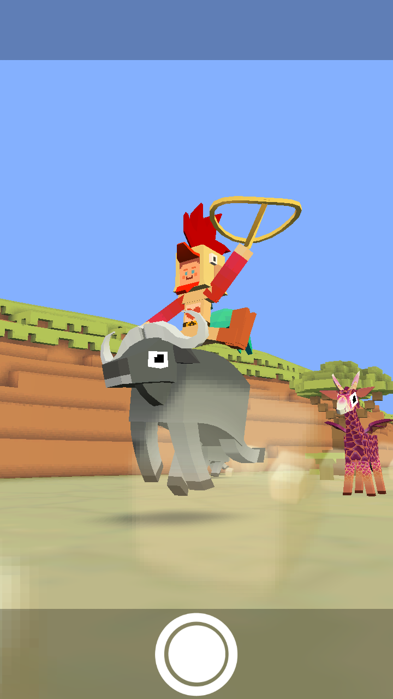
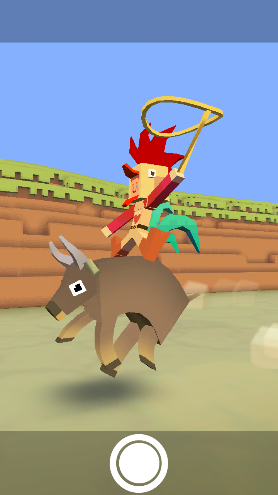
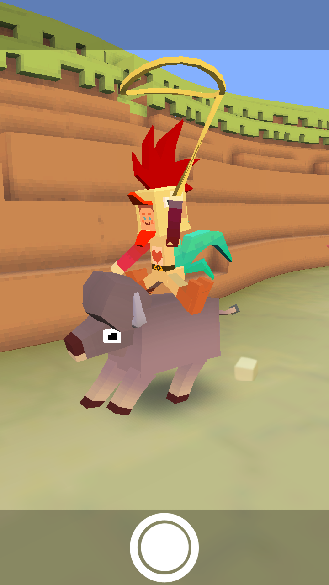
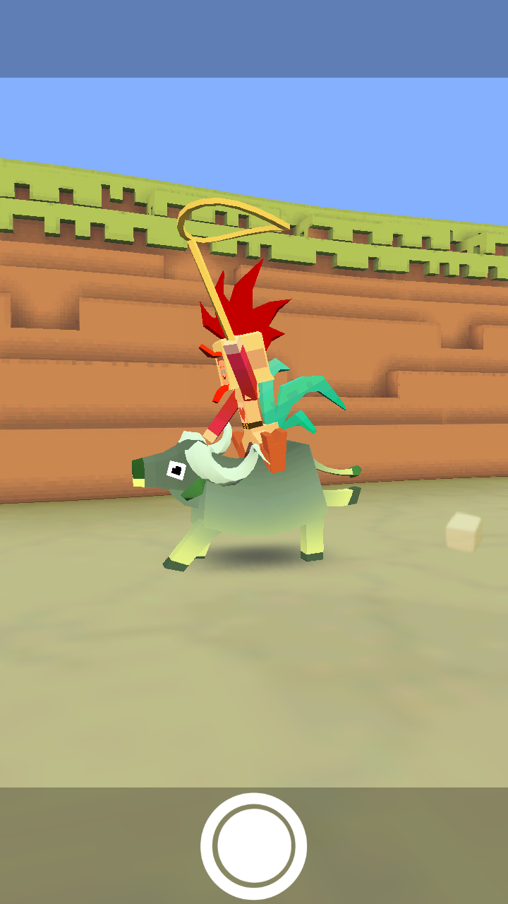
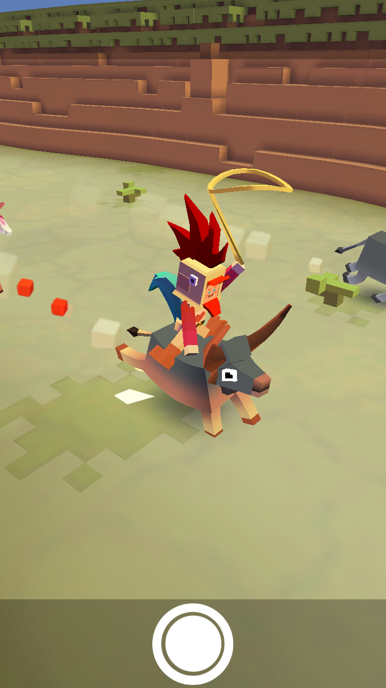
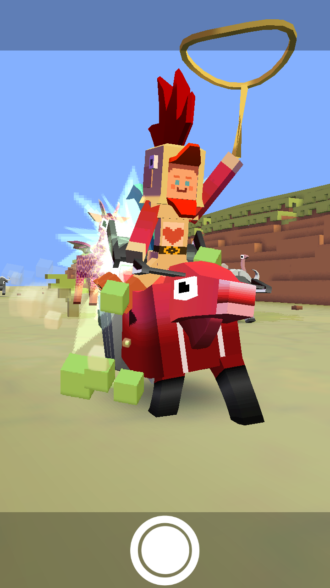
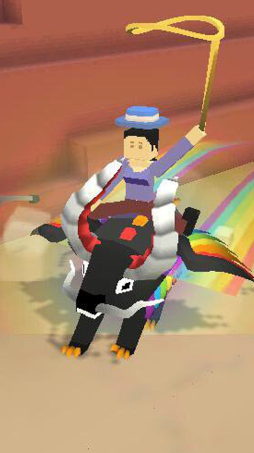

## 사바나
### 버펄로
+ 업그레이드

      1.  공중에 있을 때 버펄로가 올가미 밧줄로 다가옴
      2. 버펄로의 차분한 상태 2초 연장
      3.  버펄로에 착지하면 앞을 가로막는 모든 장애물을 들이받으면서 돌진
      4. 버펄로의 티켓 수익 50% 증가
      5. 버펄로의 착지 돌격이 2배 지속
      6. 출현 빈도 2배 증가
      7. 버펄로가 몸부림칠 때 보너스 동전 획득
      8. 스탬피드 중에 희귀 버펄로 출현 빈도 2배 증가
      9. 스탬피드에 새로운 희귀 버펄로 추가
***
+ 특징 : 화가 날 때 콩콩 뛴다.
***
+ 종류
  1. 케이프 버펄로 (기본 동물)

    + 사진 : 
    + 설명 : 아프리카 버펄로 또는 케이프 버펄로는 큰 아프리카 소입니다.
    + 출현거리 : 0m 부터
    + 경험치 획득량 : 0xp
    + 새끼 동물 능력 : 동물 화나는 속도 3% 감소
***
  2. 포레스트 버펄로

      + 사진 : 
      + 설명 : 나무 사이에 숨기 좋아하는 날씬한 버펄로입니다.
      + 출현거리 : 150m 부터
      + 경험치 획득량 : 1xp
      + 새끼 동물 능력 : 동물 화나는 속도 4% 감소, 희귀 동물 출현 2% 증가
***
  3. 워터 버펄로

      + 사진 : 
      + 설명 : 사육된 버펄로는 야생 친구들보다 차분한 편입니다.
      + 출현거리 : 300m 부터
      + 경험치 획득량 : 3xp
      + 새끼 동물 능력 : 동물 화나는 속도 4% 감소, 물 위에서 점프 높이 10% 증가
***
  4. 들소

      + 사진 : 
      + 설명 : 크고 터프하며 , 70년대 이후로 이발을 한 번도 안했다는군요.
      + 출현거리 : 600m 부터
      + 경험치 획득량 : 14xp
      + 새끼 동물 능력 : 밧줄 작아지는 속도 5% 감소, 동물 화나는 속도 5% 감소, 시작시 밧줄 크기 1% 증가(Passive)
***
  5. 컬리펄로

      + 사진 : 
      + 설명 : 이번 시즌 런웨이에 데뷔한 강렬한 신인 디자이너 버펄로입니다. 벌써부터 큰 주목을 받고 있습니다.
      + 출현거리 : 1000m 부터
      + 경험치 획득량 : 30xp
      + 새끼 동물 능력 : 동물 화나는 속도 5% 감소, 짝짓기 동물 출현 8% 증가, 짝짓기 동물 길들이는 속도 5% 증가
***
  6. 디아 버펄로
      + 사진 : 
      + 설명 : 각오 단단히 하는게 좋을거예요. 아주 매콤한 녀석이거든요.
      + 출현거리 : 0m 부터
      + 경험치 획득량 : 3xp
      + 새끼 동물 능력 : 동물 화나는 속도 4% 감소, 동물 위에서 점프 높이 8% 증가
      + 비밀 동물 : 버펄로 한 마리로 700m 주행 시 등장
***
  7. 버페라리

      + 사진 : 
      + 설명 : 양보르기니보다 훨씬 빠릅니다.
      + 출현거리 : 500m 부터
      + 경험치 획득량 : 14xp
      + 새끼 동물 능력 : 동물 화나는 속도 4% 감소, 타고 있는 동물의 속도 14% 증가, 동물 위에서 점프 속도 5% 증가
      + 희귀동물 : 레벨 9 업그레이드 후 등장
***
  8. 마법의 드래곤 버프

      + 사진 : 
      + 설명 : 마법의 드래곤 버프는 동물원에 살며 무리에서 달릴 때는 사바나에서 뛰놀지요.
      + 출현거리 : 600m 부터
      + 경험치 획득량 : 30xp
      + 새끼 동물 능력 : 시작시 밧줄 크기 6% 증가, 밧줄 작아지는 속도 6% 감소, 동물 화나는 속도 6% 감소
      + 멸종위기종 : 하루에 한번씩 달라지는 멸종위기종을 잡는 시기에 잡을 수 있다.
