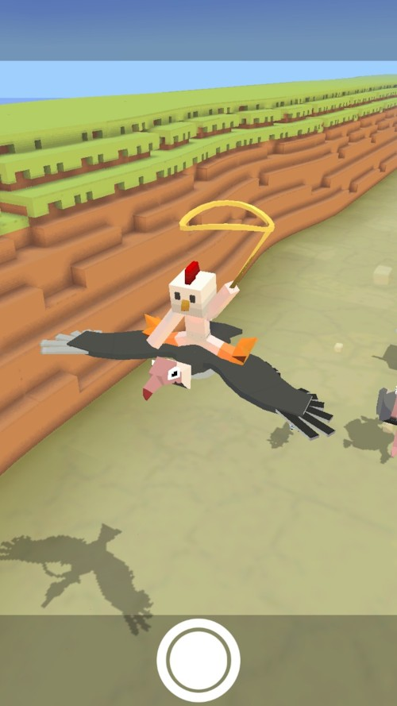
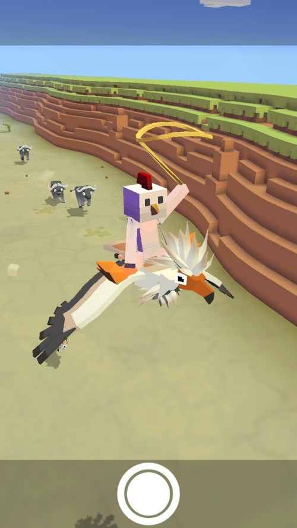
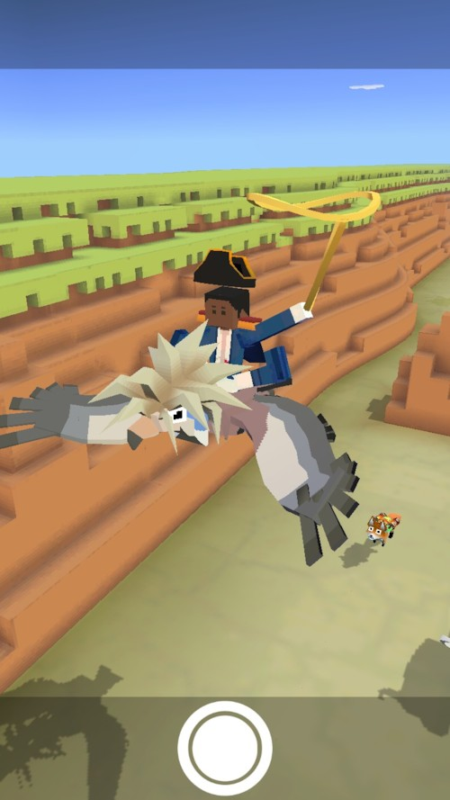
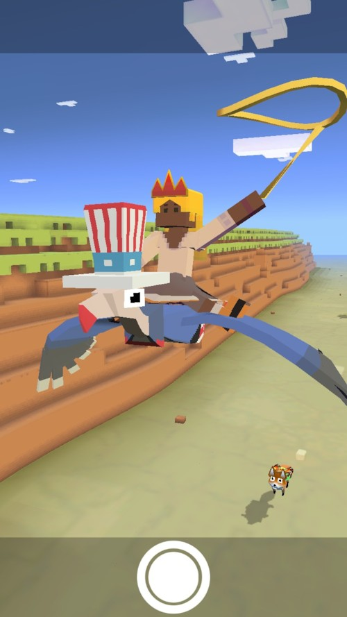
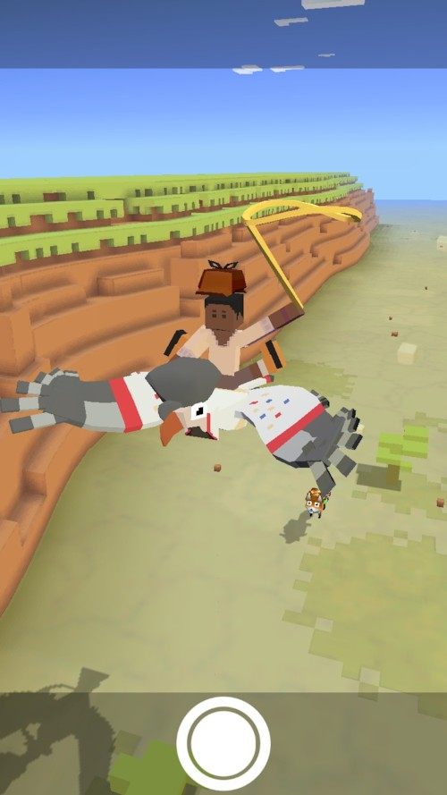
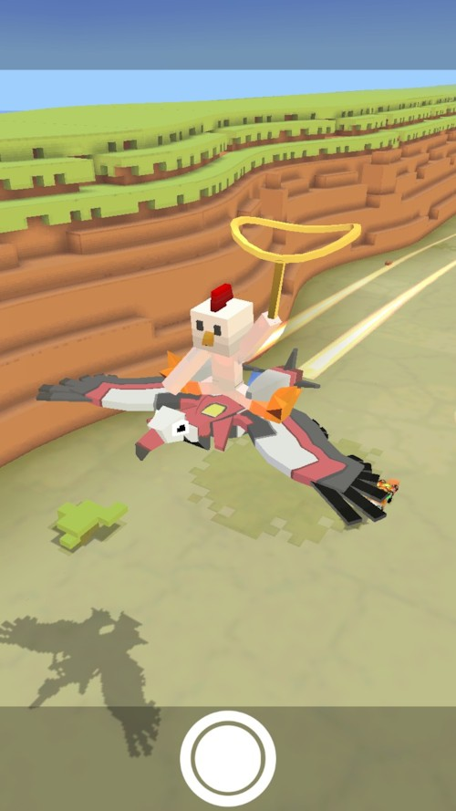
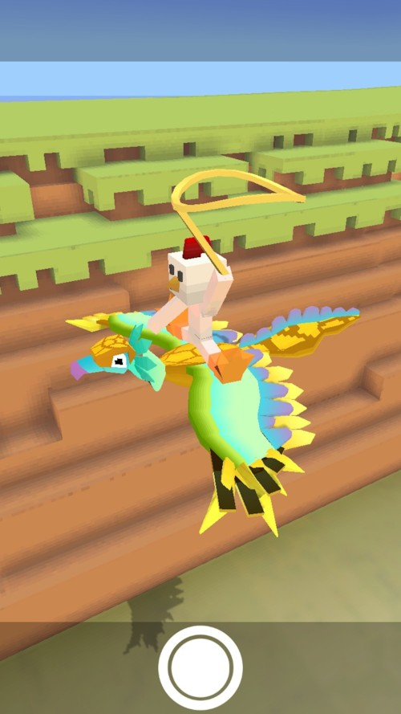
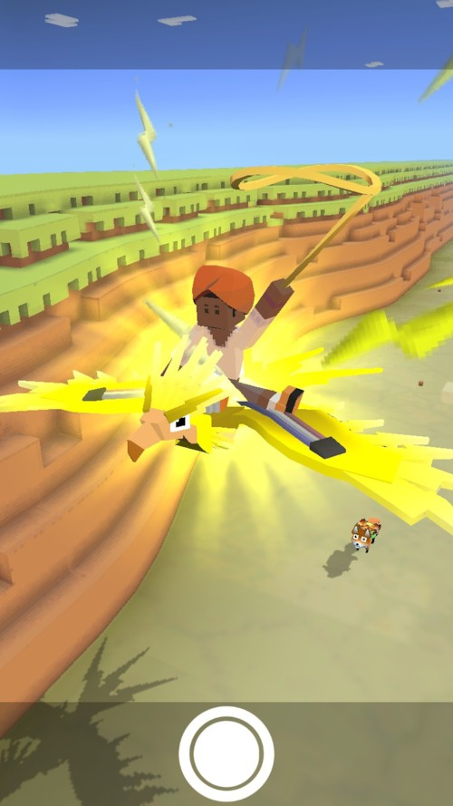
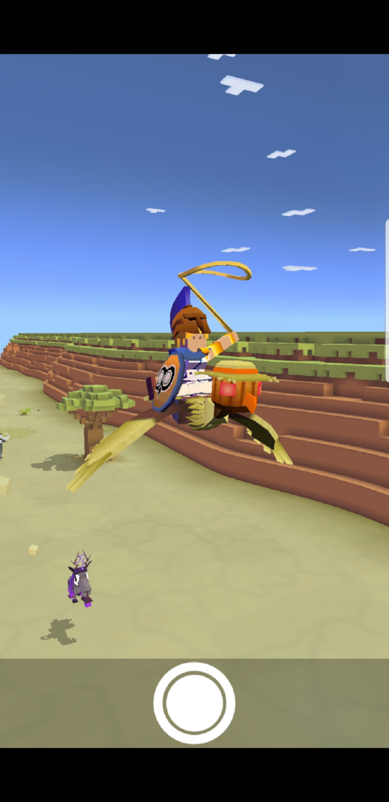

## 사바나
### 벌처
+ 업그레이드

      1. 스탬피드 중에 벌처의 출현 빈도 2배 증가
      2. 야생 벌처가 낮은 바위에 앉음
      3. 벌처를 타는 동안 상자 보상 5배 증가
      4. 벌처의 티켓 수익 50% 증가
      5. 벌처의 안정적인 비행 시간 증가
      6. 벌처의 차분한 상태 2초 증가
      7. 벌처에서 급강하 시 보너스 동전 획득
      8. 스탬피드 중에 희귀 벌처의 출현 빈도 2배 증가
      9. 스탬피드에 새로운 희귀 벌처 추가

***
+ 특징 : 화가 날 때 위아래로 오르락내리락 한다. 썩은 고기를 찾으러 먼 거리도 마다하지 않고 여행합니다. 하도 공짜를 좋아해서 머리가 시원하게 벗겨졌습니다.
***
+ 종류
  1. 벌처 (기본 동물)

    + 사진 : 
    + 설명 : 뛰어다니지 않고 바위에 앉아있다.
    + 출현거리 : 0m 부터
    + 경험치 획득량 : 0xp
    + 새끼 동물 능력 : 시작시 밧줄 크기 4% 증가
***
  2. 이집트 벌처

      + 사진 : 
      + 설명 : 대머리 사촌들과는 달리, 놀라운 모발제를 발견했다고 합니다.
      + 출현거리 : 1000m 부터
      + 경험치 획득량 : 3xp
      + 새끼 동물 능력 : 시작시 밧줄 크기 4% 증가, 날짐승 급강 속도 4% 증가
***
  3. 팝 벌처

      + 사진 : 
      + 설명 : 일본에서 매우 인기있는 독수리입니다.
      + 출현거리 : 2000m 부터
      + 경험치 획득량 : 30xp
      + 새끼 동물 능력 : 시작시 밧줄 크기 5% 증가. 동물 길들이는 속도 12% 증가, 짝짓기 동물 길들이는 속도 12% 증가
***
  4. 자본가 벌처

      + 사진 : 
      + 설명 : "죽어가는 회사를 구한 내게 왜 아무도 고마워하지 않는 거지?"
      + 출현거리 : 1500m 부터
      + 경험치 획득량 : 14xp
      + 새끼 동물 능력 : 시작시 밧줄 크기 6% 증가, 상자에서 획득하는 동전 18% 증가, 미션을 획득하는 동전 6% 증가
***
  5. 화려한 벌처

      + 사진 : 
      + 설명 : 사바나 일대에서 엘비스 흉내를 가장 잘 냅니다.
      + 출현거리 : 1000m 부터
      + 경험치 획득량 : 3xp
      + 새끼 동물 능력 : 시작시 밧줄 크기 4% 증가, 짝짓기 동물 출현 9% 증가
***
  6. 벌처론

      + 사진 : 
      + 설명 : 사실 벌처론은 아주 작은 로봇 벌처 여러 마리를 합체하여 만들어졌습니다.
      + 출현거리 : 1000m 부터
      + 경험치 획득량 : 5xp
      + 새끼 동물 능력 : 시작시 밧줄 크기 8% 증가, 희귀 동물 출현 5% 증가, 밧줄 작아지는 속도 1% 감소(Passive)
      + 보스 동물 : 기린이나 독수리, 코끼리로 언덕 위에 접근해서 얻는다.
***
  7. 드라코리안

      + 사진 : 
      + 설명 : 낙원에 산다는 우아한 독수리와 닮았지만 사실은 선사시대의 도마뱀입니다.
      + 출현거리 : 1500m 부터
      + 경험치 획득량 : 14xp
      + 새끼 동물 능력 : 시작시 밧줄 크기 6% 증가, 동물 위에서 점프 속도 4% 증가, 날짐승 급강 속도 6% 감소
      + 희귀동물 : 레벨 9 업그레이드 후 등장
***
  8. 볼트수리

      + 사진 : 
      + 설명 : 잠재력이 상당한 고압 조류입니다. 물을 멀리하세요.
      + 출현거리 : 1100m 부터
      + 경험치 획득량 : 30xp
      + 새끼 동물 능력 : 시작시 밧줄 크기 6% 증가, 동물 위에서 점프 속도 4% 증가, 날짐승 급강 속도 6% 감소
      + 멸종위기종 :　하루에 한번씩 달라지는 멸종위기종을 잡는 시기에 잡을 수 있다.
***
  9. 허수아비수리

      + 사진 : 
      + 설명 : 이 허수아비수리는 왜 다른 새들이 자기를 피하는지 전혀 모릅니다.
      + 출현거리 : 1200m 부터
      + 경험치 획득량 : 3xp
      + 새끼 동물 능력 : 시작시 밧줄 크기 6% 증가, 동물 위에서 점프 높이 4% 증가, 날짐승 급강 속도 6% 감소
      + 이벤트 동물 ： 2017년 할로윈 이벤트
