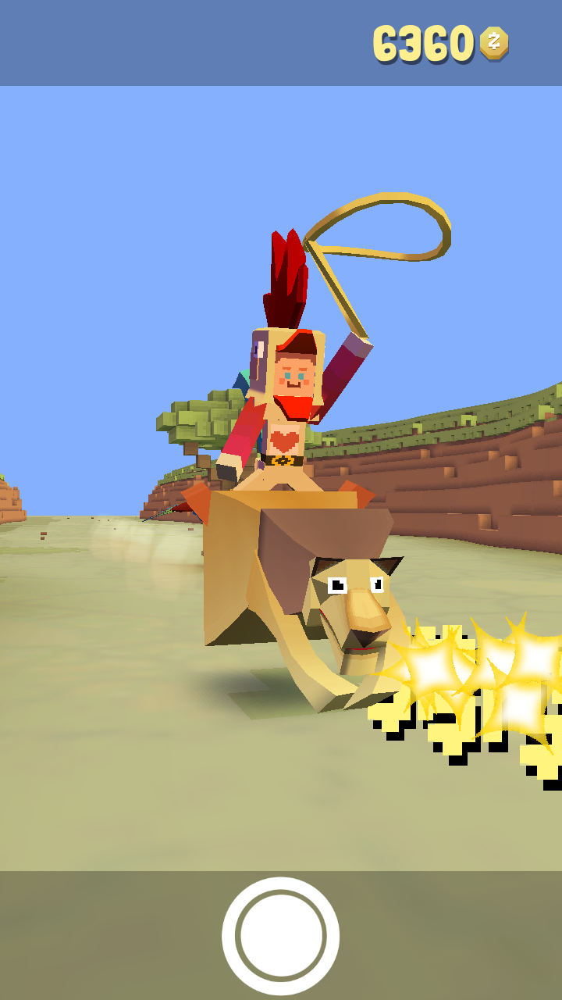
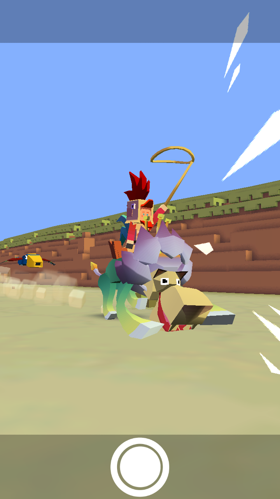
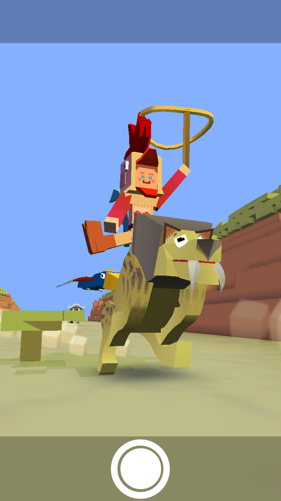
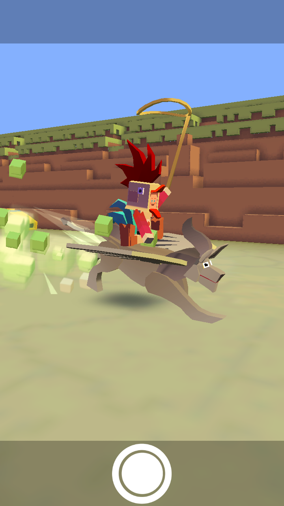
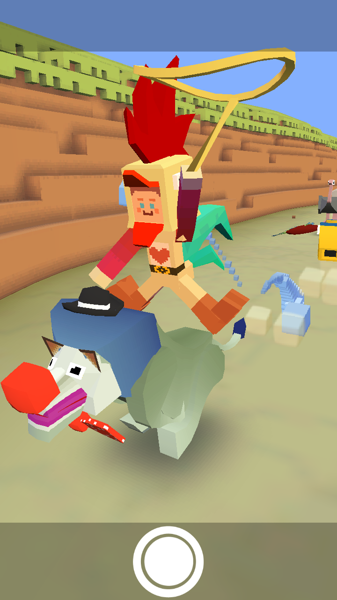
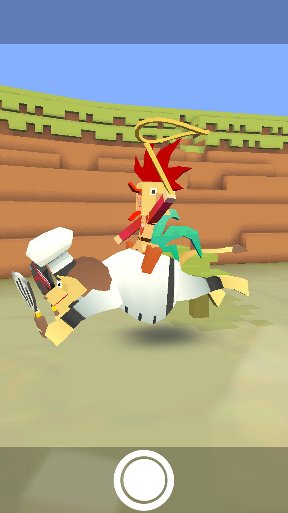
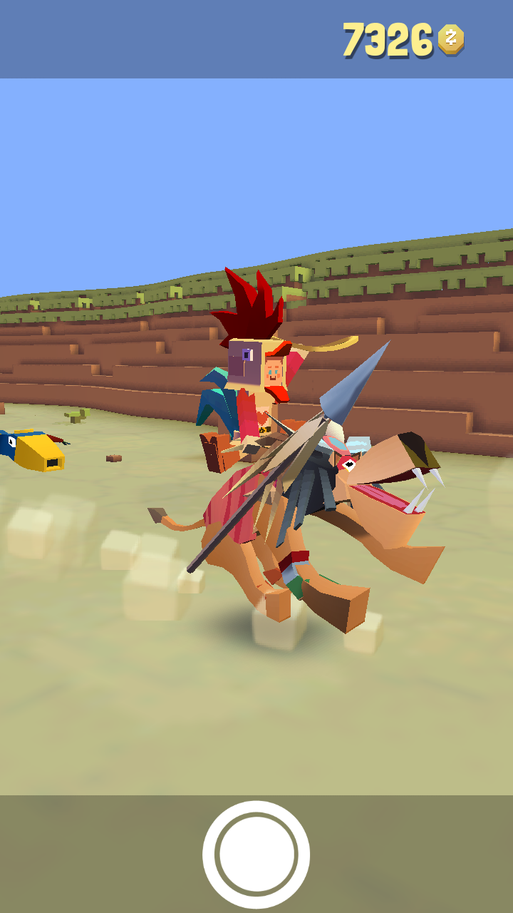
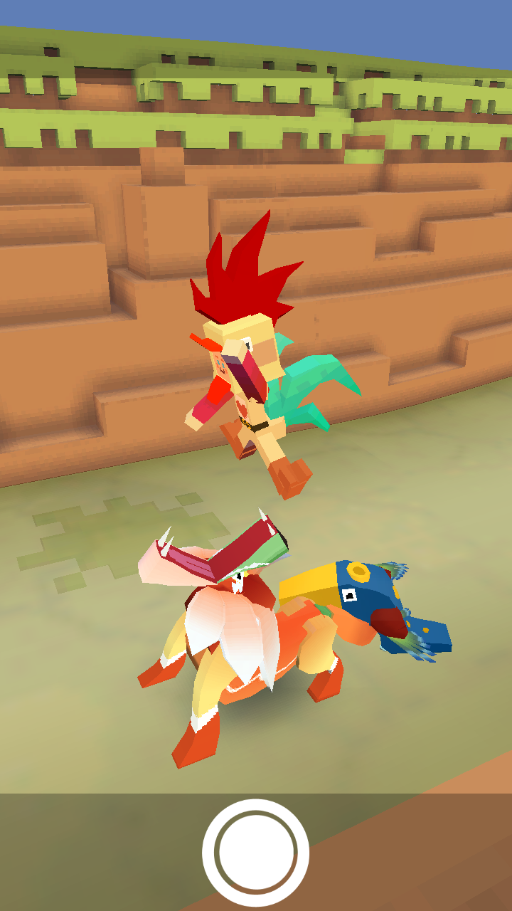
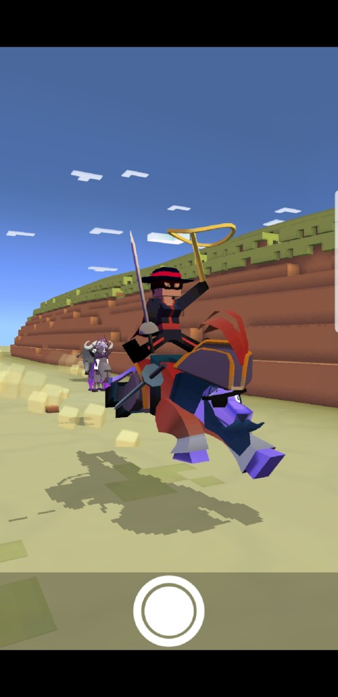

## 사바나
### 사자
+ 업그레이드

      1. 스탬피드 중에 사자의 출현 빈도 3배 증가
      2. 동물 사냥 시 사자의 행복 상태 더 오래 지속
      3. 사자가 다른 사자를 사냥 가능
      4. 사자의 티켓 수익 50% 증가
      5. 사자가 무엇이든 사냥 가능
      6. 동물 사냥 시 사자 행복 상태 더 오래 지속
      7. 사자를 타고 다른 동물 사냥하면 보너스 동전 획득
      8. 스탬피드 중에 희귀 사자의 출현 빈도 2배 증가
      9. 스탬피드에 새로운 희귀 사자 추가

***
+ 특징 : 화가 날 때 플레이어를 먹어버린다. 사자는 자주 배가 고파진다.
***
+ 종류
  1. 사자 (기본 동물)
<<<<<<< HEAD
    + 사진 : 
=======
    + 사진 : 
>>>>>>> release/사바나_추가,_링크_수정
    + 설명 : 코끼리를 제외한 동물을 사냥할 수 있다.
    + 출현거리 : 1000m 부터
    + 경험치 획득량 : 0xp
    + 새끼 동물 능력 : 동물 사냥 효과 8% 증가
***
  2. 단델리온
<<<<<<< HEAD
      + 사진 : 
=======
      + 사진 : 
>>>>>>> release/사바나_추가,_링크_수정
      + 설명 : 세상에서 가장 희귀하고 무서운 육식성 식물입니다. 너무 가까이 가지 마세요, 만만히 볼 상대가 아니랍니다.
      + 출현거리 : 1150m 부터
      + 경험치 획득량 : 1xp
      + 새끼 동물 능력 : 동물 사냥 효과 6% 증가, 짝짓기 동물 출현 5% 증가
***
  3. 검치호
<<<<<<< HEAD
      + 사진 : 
=======
      + 사진 : 
>>>>>>> release/사바나_추가,_링크_수정
      + 설명 : 한때 꽤 유행이었죠.
      + 출현거리 : 1300m 부터
      + 경험치 획득량 : 30xp
      + 새끼 동물 능력 : 동물 위에서 점프 속도 5% 증가, 동물 사냥 효과 7% 증가
***
  4. 그리폰
<<<<<<< HEAD
      + 사진 : 
=======
      + 사진 : 
>>>>>>> release/사바나_추가,_링크_수정
      + 설명 : 장대한 신화적 괴물? 아니면 집에서 만든 의상을 입고 축제를 즐기는 고양이?
      + 출현거리 : 2200m 부터
      + 경험치 획득량 : 14xp
      + 새끼 동물 능력 : 밧줄 작아지는 속도 4% 감소, 동물 위에서 점프 높이 6% 증가, 동물 사냥 효과 6% 증가
***
  5. 울보 사자
<<<<<<< HEAD
      + 사진 : 
=======
      + 사진 : 
>>>>>>> release/사바나_추가,_링크_수정
      + 설명 : 실패한 서커스 광대. 아직도 민망함에 이불을 차고 있습니다.
      + 출현거리 : 2200m 부터
      + 경험치 획득량 : 30xp
      + 새끼 동물 능력 : 동물 길들이는 속도 10% 증가, 동물 사냥 효과 9% 증가, 짝짓기 동물 길들이는 속도 1% 증가(Passive)
***
  6. 라이언 셰프
<<<<<<< HEAD
      + 사진 : 
=======
      + 사진 : 
>>>>>>> release/사바나_추가,_링크_수정
      + 설명 : 세계적인 요리사의 영양 안티파스토를 꼭 맛보세요.
      + 출현거리 : 0m 부터
      + 경험치 획득량 : 14xp
      + 새끼 동물 능력 : 타고 있는 동물의 속도 6% 감소, 동물 사냥 효과 6% 증가, 동물 화나는 속도 1% 감소(Passive)
      + 비밀 동물 : 사자 한 마리로 30마리를 잡아먹으면 등장한다.
***
  7. 마사이 사자
<<<<<<< HEAD
      + 사진 : 
=======
      + 사진 : 
>>>>>>> release/사바나_추가,_링크_수정
      + 설명 : 사춘기 부족 사자들은 통과 의례로 무리를 지어 사람을 사냥합니다.
      + 출현거리 : 1800m 부터
      + 경험치 획득량 : 14xp
      + 새끼 동물 능력 : 동물 위에서 점프 속도 3% 증가, 동물 길들이는 속도 16% 증가, 동물 사냥 효과 6% 증가
      + 희귀동물 : 레벨 9 업그레이드 후 등장
***
  8. 괴물 니엔
<<<<<<< HEAD
      + 사진 : 
=======
      + 사진 : 
>>>>>>> release/사바나_추가,_링크_수정
      + 설명 : 중국에서 줄을 지어 춤을 추는 모습이 흔히 발견됩니다. 폭죽을 터뜨려서 쫓아낼 수 있습니다.
      + 출현거리 : 2200m 부터
      + 경험치 획득량 : 30xp
      + 새끼 동물 능력 : 동물 위에서 점프 속도 3% 증가, 동물 길들이는 속도 16% 증가, 동물 사냥 효과 6% 증가
      + 멸종위기종 :　하루에 한번씩 달라지는 멸종위기종을 잡는 시기에 잡을 수 있다.
***
  9. 바다사자
<<<<<<< HEAD
      + 사진 : 
=======
      + 사진 : 
>>>>>>> release/사바나_추가,_링크_수정
      + 설명 : 악명 높은 해적 선장 블랙메인은 바다 위의 골칫거리입니다. 정말 뛰어난 뱃사람이지만, 사실 물을 아주 무서워합니다.
      + 출현거리 : 2200m 부터
      + 경험치 획득량 : 3xp
      + 이벤트 동물 ： 2주년 기념 이벤트
