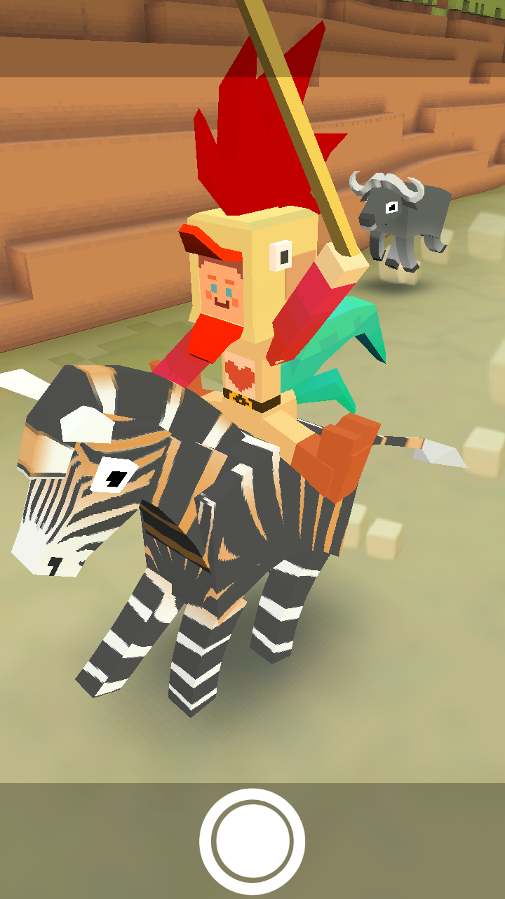
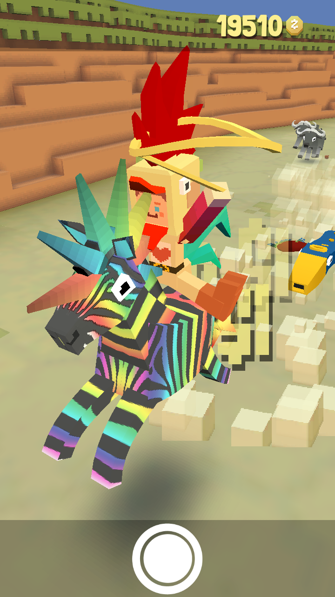
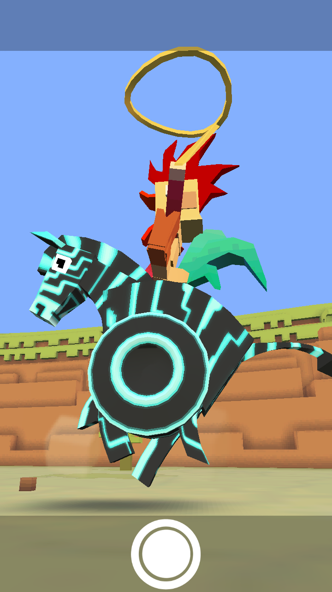
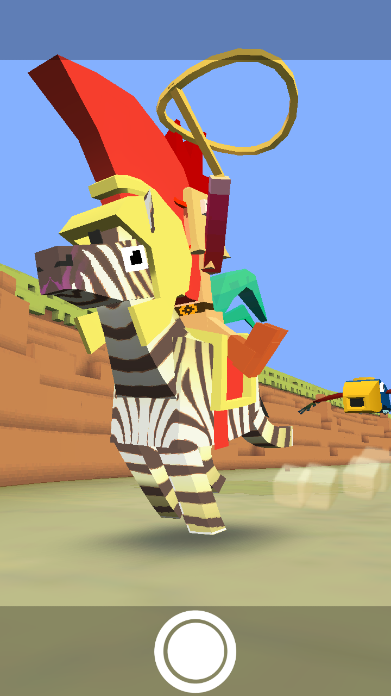
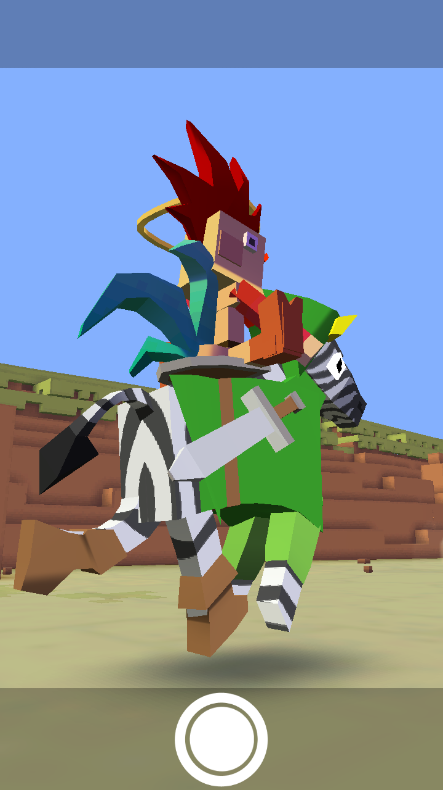
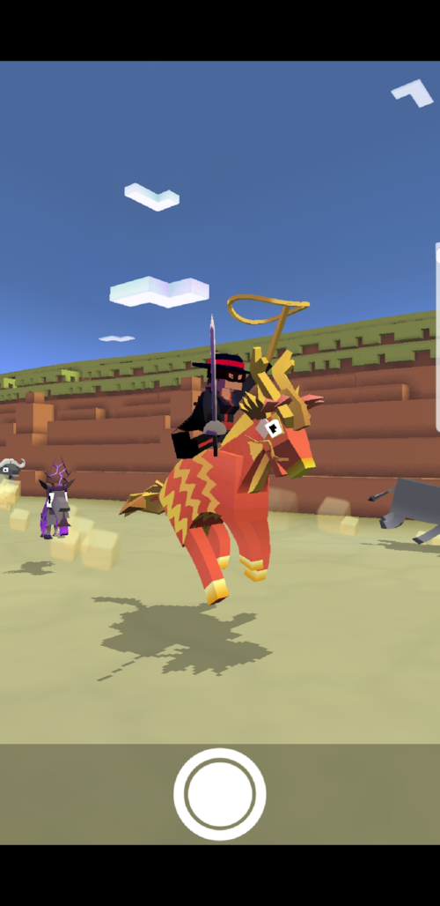

## 사바나
### 얼룩말
+ 업그레이드
      1. 얼룩말의 차분한 상태 2초 연장
      2. 얼룩말이 몸부림치면서 다른 동물을 밀어냄
      3.  얼룩말에 착지하면 올가미 밧줄 크기가 줄지 않음
      4. 얼룩말의 티켓 수익 50% 증가
      5. 화난 얼룩말의 몸부림 위력 감소
      6. 공중에 있을 때 얼룩말이 올가미 밧줄로 다가옴
      7. 얼룩말이 몸부림칠 때 보너스 동전 획득
      8. 스탬피드 중에 희귀 얼룩말 출현 빈도 2배 증가
      9. 스탬피드에 새로운 희귀 얼룩말 추가
***
+ 특징 : 화가 날 때 강 약 약으로 3번을 밟는다.
***
+ 종류
  1. 얼룩말 (기본 동물)
    + 사진 : ![Cape Buffalo(./zebra picture/Regular Zebra.png)
    + 설명 : 처음엔 하얀색 말에 검은 줄무늬가 있는 줄 알았죠. 얼룩말에게 줄무늬는 언제나 자랑스럽습니다.
    + 출현거리 : 0m 부터
    + 경험치 획득량 : 0xp
    + 새끼 동물 능력 : 밧줄 작아지는 속도 4% 감소
***
  2. 말룩얼
      + 사진 : 
      + 설명 : 얼룩말의 거꾸로 사촌. 실은 염색한 줄무늬가 있는 갈색 말이랍니다.
      + 출현거리 : 200m 부터
      + 경험치 획득량 : 1xp
      + 새끼 동물 능력 : 밧줄 작아지는 속도 5% 감소, 몸부림 5% 감소
***
  3. 사탕말
      + 사진 : 
      + 설명 : 당뇨병에 걸린 사자 수 급증의 원인.
      + 출현거리 : 1000m 부터
      + 경험치 획득량 : 3xp
      + 새끼 동물 능력 : 밧줄 작아지는 속도 5% 감소, 희귀 동물 출현 4% 증가
***
  4. 펑키 얼룩말
      + 사진 : 
      + 설명 : 이 얼룩말은 무리를 따라다니지 않습니다.
      + 출현거리 : 1600m 부터
      + 경험치 획득량 : 14xp
      + 새끼 동물 능력 : 밧줄 작아지는 속도 6% 감소, 타고 있는 동물의 속도 10% 증가, 희귀 동물 출현 1% 증가(Passive)
***
  5. 일렉트로 얼룩말
      + 사진 : 
      + 설명 : 사용자를 위해 싸워줍니다.
      + 출현거리 : 2200m 부터
      + 경험치 획득량 : 30xp
      + 새끼 동물 능력 : 밧줄 작아지는 속도 9% 감소, 동물 길들이는 속도 15% 증가
***
  6. 트로잔 얼룩말
      + 사진 : 
      + 설명 : 스파르타를 위해서!
      + 출현거리 : 1000m 부터
      + 경험치 획득량 : 25xp
      + 새끼 동물 능력 : 밧줄 작아지는 속도 6% 감소, 짝짓기 동물 출현 8% 증가, 짝짓지 동물 길들이는 속도 5% 증가
      + 비밀 동물 : 다른 종류의 동물들을 겹치지 않고 7마리 탔을 때 등장.
***
  7. 전설의 얼룩말
      + 사진 : 
      + 설명 : 줄무늬의 영웅을 우러러 보십시오.
      + 출현거리 : 1600m 부터
      + 경험치 획득량 : 14xp
      + 새끼 동물 능력 : 밧줄 작아지는 속도 8% 감소, 상자에서 획득하는 동전 25% 증가
      + 희귀동물 : 레벨 9 업그레이드 후 등장
***
  8. 제가수스
      + 사진 : 
      + 설명 : 공중에서 눈에 더 잘 띄도록 줄무늬가 있는 페가수스라고 할 수 있습니다.
      + 출현거리 : 1600m 부터
      + 경험치 획득량 : 30xp
      + 새끼 동물 능력 : 밧줄 작아지는 속도 8% 감소, 짯짓기 동물 출현 1% 증가(Passive)
      + 멸종위기종 : 하루에 한번씩 달라지는 멸종위기종을 잡는 시기에 잡을 수 있다.
***
  9. 키린
      + 사진 : 
      + 설명 : 보는 이에게 행운을 가져다준다고 합니다!
      + 출현거리 : 1600m 부터
      + 경험치 획득량 : 3xp
      + 새끼 동물 능력 : 밧줄 작아지는 속도 8% 감소, 짝짓기 동물 출현 1% 증가(Passive)
      + 이벤트 동물 ： 2018년 구정 이벤트
***
  10. 메리고라운드
      + 사진 : 
      + 설명 : 사바나를 돌아다니는것보다 아이들을 태워주는걸 더 좋아합니다.
      + 출현거리 : 1200m 부터
      + 경험치 획득량 : 3xp
      + 이벤드 동물: 어린이축제 이벤트
