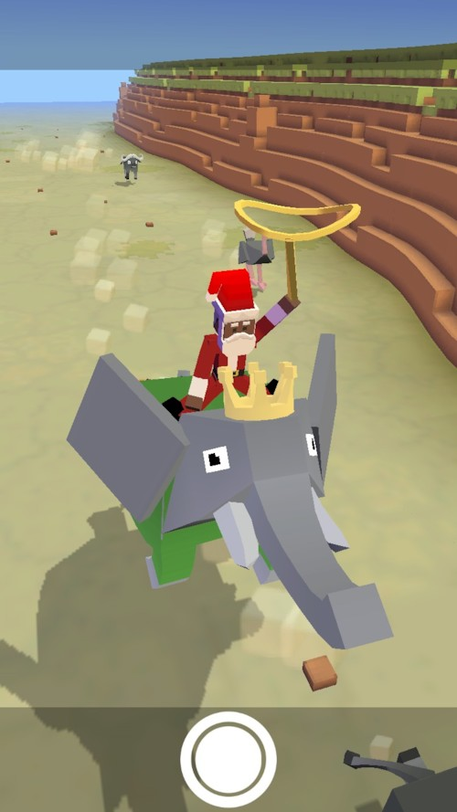
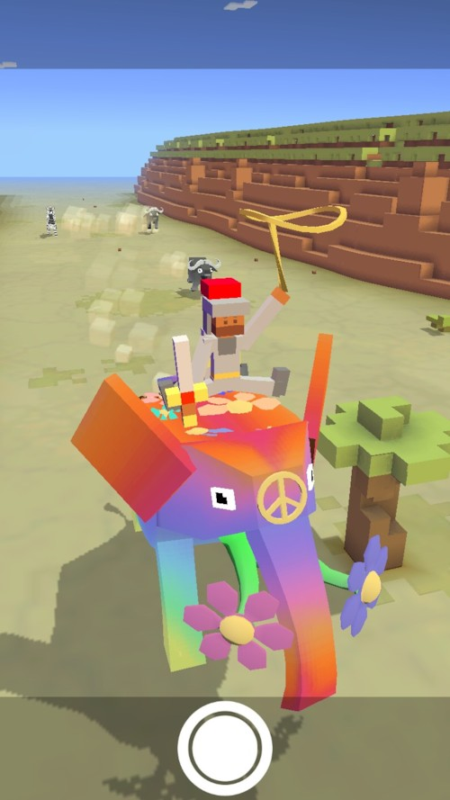
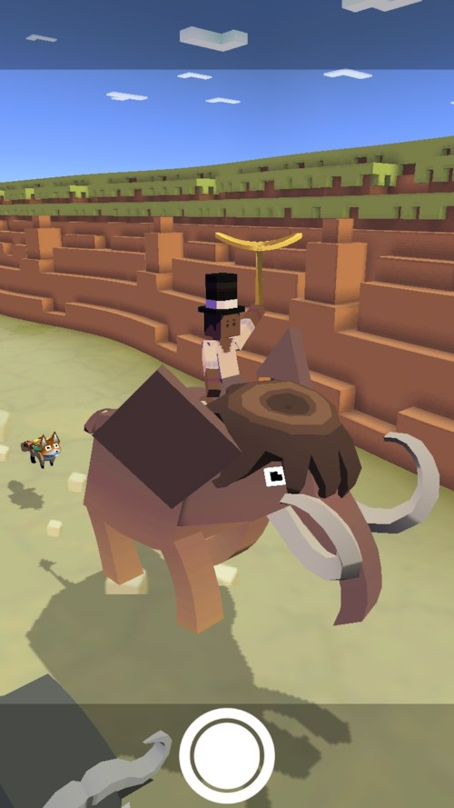
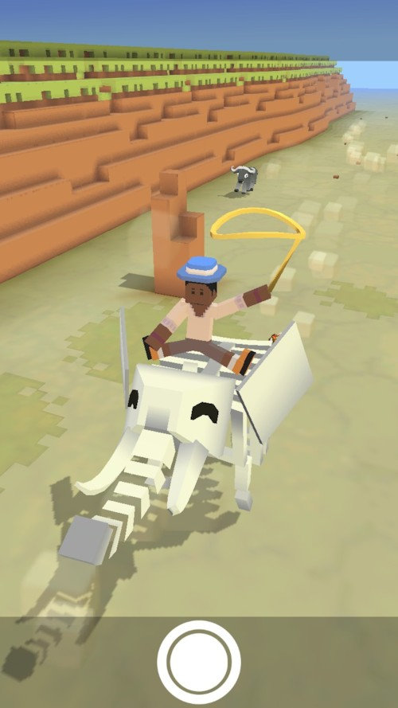
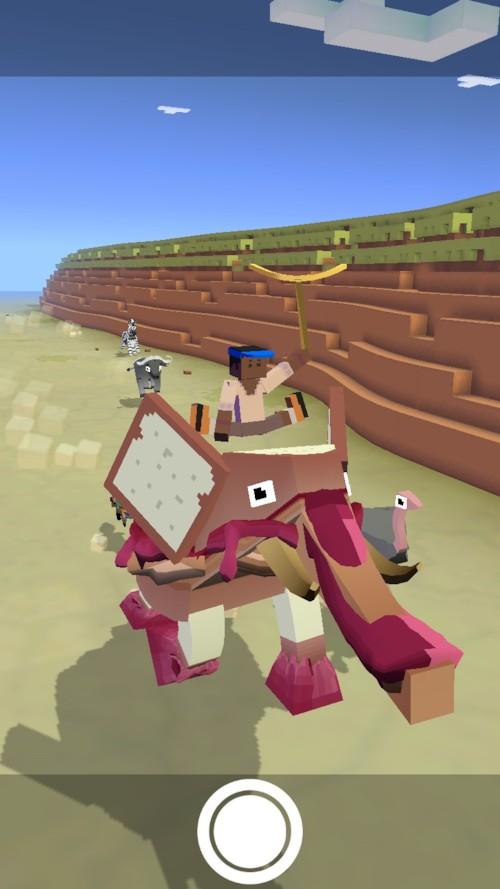

## 사바나
### 코끼리
+ 업그레이드

      1. 스탬피드 중에 코끼리의 출현 빈도 2배 증가
      2. 코끼리의 차분한 상태 1초 연장
      3. 코끼리가 바위를 들이받을 수 있음
      4. 코끼리의 티켓 수익 50% 증가
      5. 코끼리가 다른 코끼리를 들이받을 수 있음
      6. 코끼리의 차분한 상태 1초 연장
      7. 코끼리로 장애물 들이받으면 보너스 동전 획득
      8. 스탬피드 중에 희귀 코끼리의 출현 빈도 2배 증가
      9. 스탬피드에 새로운 희귀 코끼리 추가

***
+ 특징 : 화가 날 때 플레이어를 던져버린다. 같은 코끼리를 제외한 모든 동물과 나무를 들이받을 수 있다.
***
+ 종류
  1. 아프리카 코끼리 (기본 동물)
    + 사진 : 
    + 설명 : 7천 킬로그램에 육박하는 코끼리는 육지에서 가장 큰 포유동물입니다. 나무를 쉽게 일구어 나가죠.
    + 출현거리 : 0m 부터
    + 경험치 획득량 : 0xp
    + 새끼 동물 능력 : 타고 있는 동물의 속도 3% 감소
***
  2. 코끼리 군주
      + 사진 : 
      + 설명 : 코끼리들 중에서 가장 세련된 코끼리입니다.
      + 출현거리 : 500m 부터
      + 경험치 획득량 : 3xp
      + 새끼 동물 능력 : 타고 있는 동물의 속도 3% 감소, 미션으로 획득하는 동전 8% 증가, 상자에서 획득하는 동전 2% 증가(Passive)
***
  3. 히피 코끼리
      + 사진 : 
      + 설명 : 이 코끼리는 권위에 굴하지 않는 자유로운 영혼을 가졌지요.
      + 출현거리 : 1000m 부터
      + 경험치 획득량 : 14xp
      + 새끼 동물 능력 : 동물 화나는 속도 3% 감소, 타고 있는 동물의 속도 3% 감소, 짝짓기 동물 출현 6% 증가
***
  4. 매머드
      + 사진 : 
      + 설명 : 멸종 위기에 있긴 하지만 코끼리보다 크고, 강하고, 털이 많습니다.
      + 출현거리 : 200m 부터
      + 경험치 획득량 : 1xp
      + 새끼 동물 능력 : 타고 있는 동물의 속도 6% 감소
***
  5. 나팔코끼리
      + 사진 : 
      + 설명 : 한 번은 밴드 캠프에서...
      + 출현거리 : 1500m 부터
      + 경험치 획득량 : 30xp
      + 새끼 동물 능력 : 시작시 밧줄 크기 6% 증가, 타고 있는 동물의 속도 5% 감소
***
  6. 해골코끼리
      + 사진 : 
      + 설명 : 코끼리 묘지에는 하이에나 따위보다 훨씬 더 무서운 것이 있지요.
      + 출현거리 : 1500m 부터
      + 경험치 획득량 : 30xp
      + 새끼 동물 능력 : 밧줄 작아지는 속도 6% 감소, 짝짓기 동물 출현 8% 증가, 짝짓지 동물 길들이는 속도 5% 증가
      + 보스 동물 : 일정양의 미션을 클리어 후 보스 미션에서 등장.
***
  7. 젤레펀트
      + 사진 : 
      + 설명 : 땅콩버터 젤레펀트는 점심도시락목에 속하는 동물종에서 가장 건강합니다.
      + 출현거리 : 1000m 부터
      + 경험치 획득량 : 14xp
      + 새끼 동물 능력 : 타고 있는 동물의 속도 4% 감소, 동물 사냥 효과 6% 증가, 희귀 동물 출현 4% 증가
      + 이벤트 동물 : 페이스북 공유 이벤트 후 추가
***
  8. 소화전 코끼리
      + 사진 : 
      + 설명 : 이 옆에다 주차하면 딱지가 붙습니다!
      + 출현거리 : 1000m 부터
      + 경험치 획득량 : 14xp
      + 새끼 동물 능력 : 타고 있는 동물의 속도 4% 감소, 동물 위에서의 점프 속도 6% 증가, 동물 길들이는 속도 8% 증가
      + 희귀동물 : 레벨 9 업그레이드 후 등장
***
  9. 축복의 코끼리
      + 사진 : 
      + 설명 : 이 코끼리에게 소원을 빌면 행복이 찾아온다고 합니다.
      + 출현거리 : 500m 부터
      + 경험치 획득량 : 3xp
      + 새끼 동물 능력 : 타고 있는 동물의 속도 3% 감소, 미션으로 획득하는 동전 5% 증가
      + 이벤트 동물 ： 2018년 구정 이벤트